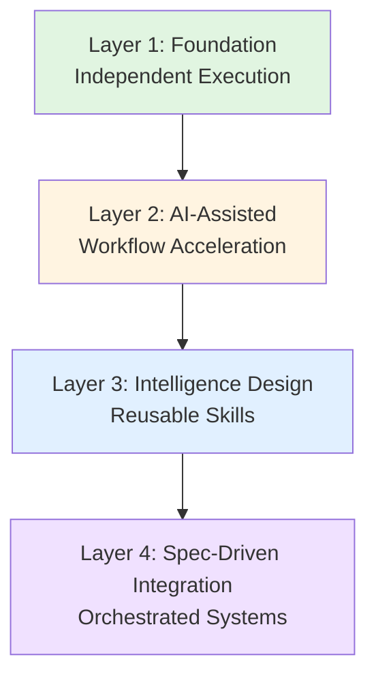

# Chapter 1: Introduction to Physical AI

## Overview

Welcome to "Physical AI & Humanoid Robotics"! This course bridges your digital AI knowledge to the world of embodied intelligence—AI systems that sense, reason, and act in the physical world.

**What you'll learn in this chapter:**
- The fundamental differences between digital and physical AI
- The 4-layer learning framework that guides this course
- Key components of humanoid robotics systems
- How to set up your development environment

:::info Prerequisites
**Background**: Basic programming (Python), familiarity with AI concepts (machine learning, neural networks)

**No prior robotics experience required** - we'll build from the ground up!
:::

---

## Why Physical AI?

Digital AI excels at tasks like language understanding, image classification, and game playing. But the physical world presents unique challenges:

- **Real-time constraints**: A humanoid robot can't wait 10 seconds to decide where to step
- **Uncertainty**: Sensors are noisy, environments are unpredictable
- **Safety-critical**: Wrong decisions can damage hardware or harm people
- **Embodiment**: Intelligence emerges from body-environment interaction

**Example**: A language model can write perfect Python code, but a humanoid robot must maintain balance while picking up an object—a task that requires continuous sensorimotor coordination.

---

## The 4-Layer Learning Framework

This course uses a progressive learning model:



### Layer 1: Foundation - Independent Execution (Chapters 1-3)
- **Focus**: Master ROS 2 basics without AI assistance
- **Goal**: ≥75% task completion independently
- **Why**: Build solid fundamentals before adding complexity

### Layer 2: AI-Assisted - Workflow Acceleration (Chapters 4-5)
- **Focus**: Use AI to identify patterns and optimize workflows
- **Goal**: Document ≥5 reusable patterns per module
- **Why**: Learn when and how to leverage AI effectively

### Layer 3: Intelligence Design - Reusable Skills (Chapters 6-7)
- **Focus**: Create autonomous reasoning components
- **Goal**: Build ≥3 production-grade skills
- **Why**: Transition from learning to building

### Layer 4: Spec-Driven Integration - Capstone (Chapters 8-9)
- **Focus**: Orchestrate skills for end-to-end systems
- **Goal**: ≥70% capstone project success rate
- **Why**: Demonstrate professional robotics development capability

---

## Humanoid Robotics Architecture

A humanoid robot system integrates three core subsystems:

### 1. Perception (Sensing)
- **Cameras**: RGB, depth, stereo for vision
- **IMU**: Inertial measurement for balance
- **LiDAR**: 3D environment mapping
- **Force/Torque sensors**: Contact detection

### 2. Intelligence (Reasoning)
- **SLAM**: Simultaneous localization and mapping
- **Path Planning**: Navigation in complex environments
- **Manipulation Planning**: Grasping and object interaction
- **Learning**: Reinforcement learning for locomotion

### 3. Actuation (Action)
- **Motors**: Joint control for movement
- **Controllers**: PID, model-predictive control
- **Safety Systems**: Emergency stops, velocity limits

**Integration Layer**: ROS 2 provides the communication infrastructure connecting all components.

---

## Course Roadmap

| Chapter | Title | Duration | Layer | Key Skills |
|---------|-------|----------|-------|------------|
| 1 | Introduction to Physical AI | 4h | 1 | Environment setup, framework understanding |
| 2 | ROS 2 Fundamentals | 6h | 1 | Nodes, topics, publishers, subscribers |
| 3 | ROS 2 Packages & URDF | 6h | 1 | Robot modeling, visualization |
| 4 | Gazebo Simulation | 6h | 2 | Physics simulation, sensor modeling |
| 5 | Unity Visualization | 5h | 2 | Photorealistic rendering, ROS-Unity bridge |
| 6 | Isaac Perception | 8h | 3 | VSLAM, object detection, perception skills |
| 7 | Path Planning & RL | 8h | 3 | Navigation, reinforcement learning |
| 8 | VLA for Humanoids | 10h | 4 | Voice-language-action integration |
| 9 | Capstone Project | 12h | 4 | End-to-end autonomous system |
| 10 | Hardware & Lab Setup | 4h | Practice | Real-world deployment |
| 11 | Safety & Best Practices | 4h | Practice | Risk assessment, ethics |

**Total**: ~73 hours of hands-on learning

---

## Development Environment Setup

### Required Software

**Operating System**: Ubuntu 22.04 LTS (Jammy Jellyfish)

**ROS 2**: Humble Hawksbill (LTS until 2027)
```bash
# Installation (simplified - see official docs for full instructions)
sudo apt update && sudo apt install ros-humble-desktop
echo "source /opt/ros/humble/setup.bash" >> ~/.bashrc
source ~/.bashrc
```

**Python**: 3.10+ (ships with Ubuntu 22.04)

**Simulation** (installed in later chapters):
- Gazebo Harmonic
- NVIDIA Isaac Sim 2023.1.1
- Unity 2022.3 LTS

### Verification Script

**Purpose**: Validate your environment is correctly configured

```python
#!/usr/bin/env python3
"""
Purpose: Verify ROS 2 Humble installation and Python version
Prerequisites: Ubuntu 22.04, ROS 2 Humble installed
Expected Output: Version information and "Setup Complete!" message
"""

import sys
import subprocess

def check_python_version():
    """Verify Python 3.10+"""
    version = sys.version_info
    if version.major == 3 and version.minor >= 10:
        print(f"✅ Python {version.major}.{version.minor}.{version.micro}")
        return True
    else:
        print(f"❌ Python version {version.major}.{version.minor} < 3.10")
        return False

def check_ros2():
    """Verify ROS 2 Humble installation"""
    try:
        result = subprocess.run(
            ['ros2', '--version'],
            capture_output=True,
            text=True,
            check=True
        )
        print(f"✅ {result.stdout.strip()}")
        return True
    except (subprocess.CalledProcessError, FileNotFoundError):
        print("❌ ROS 2 not found in PATH")
        return False

def main():
    print("=" * 50)
    print("Physical AI Environment Validation")
    print("=" * 50)

    checks = [
        check_python_version(),
        check_ros2()
    ]

    if all(checks):
        print("\n🎉 Setup Complete! Ready for Chapter 2.")
    else:
        print("\n⚠️  Please fix errors above before proceeding.")

if __name__ == "__main__":
    main()
```

**Expected Output:**
```
==================================================
Physical AI Environment Validation
==================================================
✅ Python 3.10.12
✅ ros2 cli version 0.25.2

🎉 Setup Complete! Ready for Chapter 2.
```

---

## Exercises

### Exercise 1: Environment Setup Validation (Difficulty: Easy)

**Objective**: Verify your development environment meets course requirements

**Estimated Time**: 30 minutes

**Instructions**:
1. Install Ubuntu 22.04 (native, dual-boot, or VM)
2. Install ROS 2 Humble following [official instructions](https://docs.ros.org/en/humble/Installation.html)
3. Save the verification script above as `check_env.py`
4. Run: `python3 check_env.py`

**Acceptance Criteria**:
- [ ] Script outputs "Setup Complete!" message
- [ ] Python version ≥ 3.10
- [ ] ROS 2 Humble detected

**Self-Validation**:
- ✅ **All checks pass**: Proceed to Exercise 2
- ❌ **Any check fails**: Review [Troubleshooting](#troubleshooting) section below

---

### Exercise 2: Course Roadmap Mapping (Difficulty: Easy)

**Objective**: Reflect on your learning goals and map them to the 4-layer framework

**Estimated Time**: 20 minutes

**Instructions**:
1. Review the course roadmap table above
2. Identify 2-3 chapters that align with your career goals
3. Write a brief reflection (200-300 words) on:
   - What skills you currently have (e.g., "I'm comfortable with Python and ML")
   - Which layer you're most excited about and why
   - What you hope to build by the end of this course

**Acceptance Criteria**:
- [ ] Reflection document created
- [ ] Career goals mapped to specific chapters
- [ ] Learning path identified

---

### Exercise 3: Physical AI Use Case Analysis (Difficulty: Medium)

**Objective**: Analyze a real-world Physical AI system to identify perception, intelligence, and actuation components

**Estimated Time**: 45 minutes

**Instructions**:
1. Choose a Physical AI system (examples: warehouse robot, surgical assistant, autonomous drone)
2. Research the system using official documentation or technical papers
3. Write a structured analysis identifying:
   - **Perception**: What sensors does it use? (cameras, LiDAR, etc.)
   - **Intelligence**: What algorithms enable decision-making? (SLAM, path planning, ML)
   - **Actuation**: How does it move/manipulate objects? (motors, grippers)
4. Bonus: Identify the "sim-to-real gap" challenges for this system

**Acceptance Criteria**:
- [ ] System chosen and documented
- [ ] All three components (perception, intelligence, actuation) identified
- [ ] Analysis cites authoritative sources (official docs, research papers)

**Expected Output**: 300-500 word analysis document

**Example Start**:
> **System**: Boston Dynamics Spot
> **Perception**: Spot uses five stereo camera pairs providing 360° vision, plus depth sensors for terrain mapping...

---

## Troubleshooting

<details>
<summary><strong>Error: ROS 2 Humble not found in PATH</strong></summary>

**Symptoms**: Running `ros2 --version` returns `command not found`

**Root Cause**: ROS 2 environment not sourced

**Solution**:
1. Open terminal
2. Run: `source /opt/ros/humble/setup.bash`
3. Test: `ros2 --version`
4. To make permanent: `echo "source /opt/ros/humble/setup.bash" >> ~/.bashrc`

**Prevention**: Always source ROS 2 before use, or add to `.bashrc` for automatic sourcing

</details>

<details>
<summary><strong>Error: Python version mismatch (< 3.10)</strong></summary>

**Symptoms**: Import errors for recent Python features, or verification script shows Python 3.8

**Root Cause**: Ubuntu 20.04 ships with Python 3.8; this course requires 3.10+

**Solution**:
1. **Recommended**: Upgrade to Ubuntu 22.04 LTS
2. **Alternative**: Install Python 3.10 via deadsnakes PPA:
   ```bash
   sudo add-apt-repository ppa:deadsnakes/ppa
   sudo apt update
   sudo apt install python3.10 python3.10-venv
   ```

**Prevention**: Verify Ubuntu version before starting course

</details>

<details>
<summary><strong>Error: Permission denied accessing devices</strong></summary>

**Symptoms**: Cannot access camera (`/dev/video0`) or serial ports

**Root Cause**: User not in `dialout` and `video` groups

**Solution**:
```bash
sudo usermod -aG dialout,video $USER
# Logout and login for changes to take effect
```

**Prevention**: Complete system setup during initial environment configuration

</details>

---

## Assessment

:::tip Self-Check Questions

**1. What are the three core subsystems of a humanoid robot?**

**2. Why can't we directly apply digital AI techniques (like LLMs) to robot control?**

**3. In the 4-layer framework, which layer focuses on building reusable intelligence components?**

<details>
<summary>Answers</summary>

**1.** Perception (sensing), Intelligence (reasoning), and Actuation (action). These subsystems integrate via ROS 2 communication infrastructure.

**2.** Digital AI operates in virtual environments with no real-time constraints or safety requirements. Physical AI must handle sensor noise, real-time decision-making (milliseconds), embodiment constraints (balance, dynamics), and safety-critical operations.

**3.** Layer 3 (Intelligence Design) focuses on creating production-grade, reusable skills with clear interfaces and decision trees.

</details>

:::

---

## Next Steps

:::note What's Next?
Continue to [Chapter 2: ROS 2 Fundamentals](./002-chapter-2-ros2-fundamentals.md) to learn how robots communicate using publishers, subscribers, and topics.

**Prerequisites for Next Chapter:**
- ✅ Environment validation complete (Exercise 1)
- ✅ Understanding of Physical AI vs Digital AI
- ✅ Familiarity with 4-layer learning framework
:::

---

**Chapter Version**: 1.0.0
**Last Updated**: 2025-11-28
**Status**: Skeleton - Content framework complete, to be enhanced with additional examples and visuals
