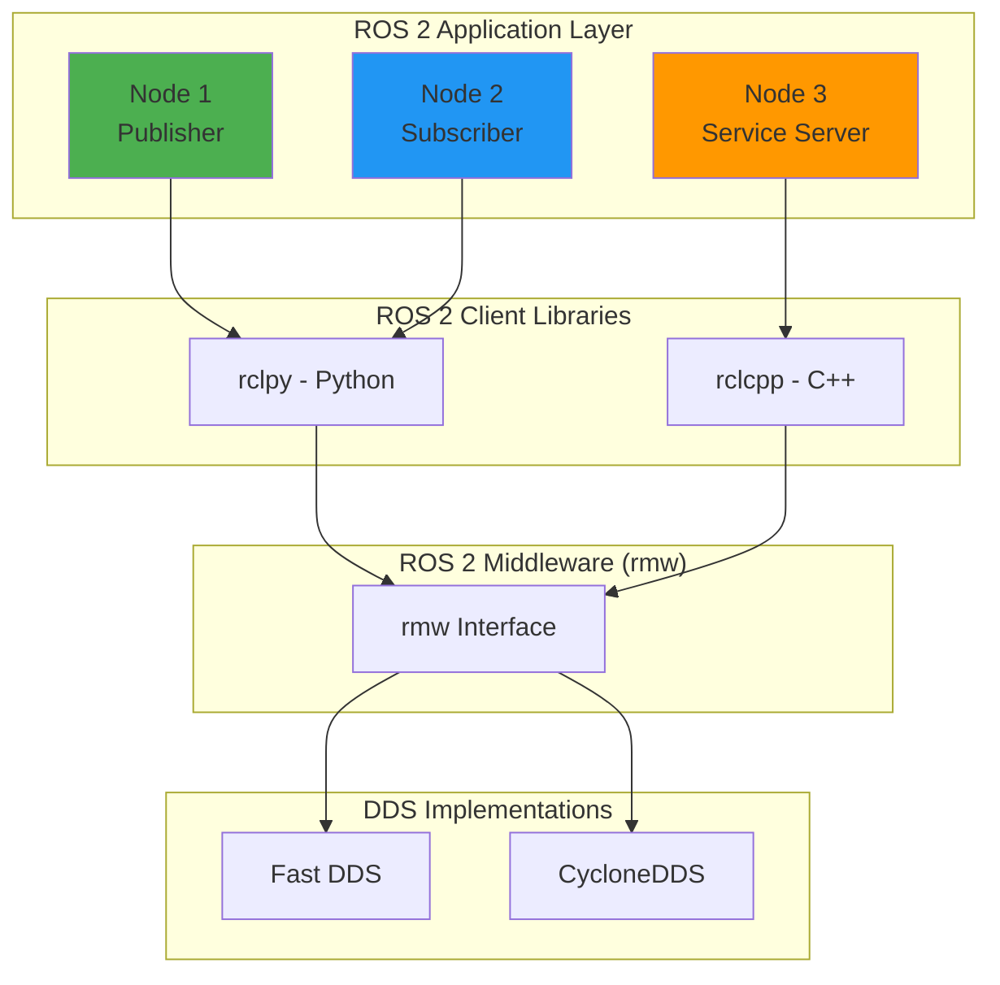

# Chapter 2: ROS 2 Fundamentals

## Overview

**Learning Objectives:**
1. Create and execute ROS 2 nodes using rclpy (Python client library)
2. Implement publisher-subscriber communication patterns
3. Configure Quality of Service (QoS) policies for reliable message delivery
4. Debug common ROS 2 communication issues (namespace, topic mismatch, QoS incompatibility)
5. Build and run ROS 2 packages using colcon build system

:::info Prerequisites
Complete [Chapter 1](./chapter-1-introduction-physical-ai) - Environment setup validated
:::

**Estimated Duration**: 6 hours (lecture + lab)

**Layer Enforcement**: This is a **Layer 1 (Foundation)** chapter. NO AI assistance prompts are provided. You must execute all exercises independently to build fundamental skills.

---

## What is ROS 2?

ROS 2 (Robot Operating System 2) is a middleware framework for building robot software. Unlike ROS 1, ROS 2 uses **DDS (Data Distribution Service)** as its underlying communication layer, providing:

- **Real-time support**: Deterministic communication for safety-critical systems
- **No central master**: Nodes discover each other via DDS
- **Cross-platform**: Runs on Linux, Windows, macOS
- **Security**: Built-in encryption and authentication (SROS2)

### Key Architecture Components



**Core Concepts:**
- **Node**: A process that performs computation (e.g., sensor driver, motion planner)
- **Topic**: Named channel for asynchronous message passing
- **Message**: Data structure (e.g., `sensor_msgs/LaserScan`)
- **QoS (Quality of Service)**: Policies controlling reliability, durability, and history

---

## Your First ROS 2 Node

### 1. Minimal Publisher Node

Let's create a simple publisher that sends string messages to a topic.

```python title="src/my_first_pkg/my_first_pkg/minimal_publisher.py"
import rclpy
from rclpy.node import Node
from std_msgs.msg import String


class MinimalPublisher(Node):
    def __init__(self):
        super().__init__('minimal_publisher')

        # Create a publisher on topic 'topic' with message type String
        self.publisher_ = self.create_publisher(String, 'topic', 10)

        # Create a timer that calls timer_callback() every 0.5 seconds
        timer_period = 0.5  # seconds
        self.timer = self.create_timer(timer_period, self.timer_callback)

        self.i = 0  # Message counter

    def timer_callback(self):
        msg = String()
        msg.data = f'Hello World: {self.i}'

        self.publisher_.publish(msg)
        self.get_logger().info(f'Publishing: "{msg.data}"')

        self.i += 1


def main(args=None):
    rclpy.init(args=args)

    minimal_publisher = MinimalPublisher()

    try:
        rclpy.spin(minimal_publisher)
    except KeyboardInterrupt:
        pass

    minimal_publisher.destroy_node()
    rclpy.shutdown()


if __name__ == '__main__':
    main()
```

**Key Components Explained:**
- `Node('minimal_publisher')`: Creates a node with name "minimal_publisher"
- `create_publisher(String, 'topic', 10)`: Creates publisher with queue size 10
- `create_timer(0.5, callback)`: Calls `timer_callback()` every 0.5 seconds
- `rclpy.spin(node)`: Keeps the node alive to process callbacks

---

### 2. Minimal Subscriber Node

Now create a subscriber that listens to the same topic.

```python title="src/my_first_pkg/my_first_pkg/minimal_subscriber.py"
import rclpy
from rclpy.node import Node
from std_msgs.msg import String


class MinimalSubscriber(Node):
    def __init__(self):
        super().__init__('minimal_subscriber')

        # Create a subscription on topic 'topic' with message type String
        self.subscription = self.create_subscription(
            String,
            'topic',
            self.listener_callback,
            10
        )
        self.subscription  # Prevent unused variable warning

    def listener_callback(self, msg):
        self.get_logger().info(f'I heard: "{msg.data}"')


def main(args=None):
    rclpy.init(args=args)

    minimal_subscriber = MinimalSubscriber()

    try:
        rclpy.spin(minimal_subscriber)
    except KeyboardInterrupt:
        pass

    minimal_subscriber.destroy_node()
    rclpy.shutdown()


if __name__ == '__main__':
    main()
```

**Key Components Explained:**
- `create_subscription(String, 'topic', callback, 10)`: Subscribes to topic
- `listener_callback(msg)`: Called automatically when a message arrives
- `msg.data`: Accesses the string data from the message

---

### 3. Running the Nodes

**Terminal 1 (Publisher):**
```bash
python3 minimal_publisher.py
```

**Expected Output:**
```
[INFO] [minimal_publisher]: Publishing: "Hello World: 0"
[INFO] [minimal_publisher]: Publishing: "Hello World: 1"
[INFO] [minimal_publisher]: Publishing: "Hello World: 2"
```

**Terminal 2 (Subscriber):**
```bash
python3 minimal_subscriber.py
```

**Expected Output:**
```
[INFO] [minimal_subscriber]: I heard: "Hello World: 0"
[INFO] [minimal_subscriber]: I heard: "Hello World: 1"
[INFO] [minimal_subscriber]: I heard: "Hello World: 2"
```

---

## ROS 2 Command-Line Tools

While your nodes are running, open a third terminal and explore these diagnostic tools.

### Inspecting Active Nodes

```bash
# List all active nodes
ros2 node list
```

**Expected Output:**
```
/minimal_publisher
/minimal_subscriber
```

**Get detailed node information:**
```bash
ros2 node info /minimal_publisher
```

**Expected Output:**
```
/minimal_publisher
  Subscribers:

  Publishers:
    /topic: std_msgs/msg/String
  Service Servers:

  Service Clients:

  Action Servers:

  Action Clients:
```

---

### Inspecting Topics

```bash
# List all active topics
ros2 topic list
```

**Expected Output:**
```
/parameter_events
/rosout
/topic
```

**View topic details:**
```bash
ros2 topic info /topic
```

**Expected Output:**
```
Type: std_msgs/msg/String
Publisher count: 1
Subscription count: 1
```

**Echo topic messages (see live data):**
```bash
ros2 topic echo /topic
```

**Expected Output (streaming):**
```
data: Hello World: 45
---
data: Hello World: 46
---
```

**Measure topic frequency:**
```bash
ros2 topic hz /topic
```

**Expected Output:**
```
average rate: 2.000
        min: 0.499s max: 0.501s std dev: 0.001s window: 10
```

---

## Quality of Service (QoS) Policies

QoS policies control the reliability, durability, and history of messages. Mismatched QoS between publisher and subscriber prevents communication.

### QoS Policy Types

| Policy | Options | Purpose |
|--------|---------|---------|
| **Reliability** | `RELIABLE`, `BEST_EFFORT` | Guaranteed delivery vs. speed |
| **Durability** | `TRANSIENT_LOCAL`, `VOLATILE` | Store messages for late-joining subscribers |
| **History** | `KEEP_LAST`, `KEEP_ALL` | How many messages to queue |
| **Depth** | Integer (e.g., 10) | Queue size when using `KEEP_LAST` |

### Example: Publisher with Custom QoS

```python title="publisher_with_qos.py"
import rclpy
from rclpy.node import Node
from rclpy.qos import QoSProfile, ReliabilityPolicy, DurabilityPolicy, HistoryPolicy
from std_msgs.msg import String


class PublisherWithQoS(Node):
    def __init__(self):
        super().__init__('publisher_with_qos')

        # Define custom QoS profile
        qos_profile = QoSProfile(
            reliability=ReliabilityPolicy.RELIABLE,  # Guaranteed delivery
            durability=DurabilityPolicy.TRANSIENT_LOCAL,  # Store for late joiners
            history=HistoryPolicy.KEEP_LAST,
            depth=10
        )

        self.publisher_ = self.create_publisher(
            String,
            'reliable_topic',
            qos_profile
        )

        self.timer = self.create_timer(1.0, self.timer_callback)
        self.i = 0

    def timer_callback(self):
        msg = String()
        msg.data = f'Reliable message {self.i}'
        self.publisher_.publish(msg)
        self.get_logger().info(f'Published: {msg.data}')
        self.i += 1


def main(args=None):
    rclpy.init(args=args)
    node = PublisherWithQoS()
    rclpy.spin(node)
    node.destroy_node()
    rclpy.shutdown()


if __name__ == '__main__':
    main()
```

---

### Example: Subscriber with Matching QoS

```python title="subscriber_with_qos.py"
import rclpy
from rclpy.node import Node
from rclpy.qos import QoSProfile, ReliabilityPolicy, DurabilityPolicy, HistoryPolicy
from std_msgs.msg import String


class SubscriberWithQoS(Node):
    def __init__(self):
        super().__init__('subscriber_with_qos')

        # MUST match publisher's QoS profile
        qos_profile = QoSProfile(
            reliability=ReliabilityPolicy.RELIABLE,
            durability=DurabilityPolicy.TRANSIENT_LOCAL,
            history=HistoryPolicy.KEEP_LAST,
            depth=10
        )

        self.subscription = self.create_subscription(
            String,
            'reliable_topic',
            self.listener_callback,
            qos_profile
        )

    def listener_callback(self, msg):
        self.get_logger().info(f'Received: {msg.data}')


def main(args=None):
    rclpy.init(args=args)
    node = SubscriberWithQoS()
    rclpy.spin(node)
    node.destroy_node()
    rclpy.shutdown()


if __name__ == '__main__':
    main()
```

**Testing QoS Mismatch:**

If subscriber uses `BEST_EFFORT` while publisher uses `RELIABLE`, they won't communicate. Check compatibility:

```bash
ros2 topic info /reliable_topic --verbose
```

Look for QoS incompatibility warnings in the output.

---

## Building ROS 2 Packages with Colcon

So far we ran Python scripts directly. In production, you organize code into **packages** built with **colcon**.

### 1. Create a Workspace

```bash
mkdir -p ~/ros2_ws/src
cd ~/ros2_ws/src
```

### 2. Create a Package

```bash
ros2 pkg create --build-type ament_python my_first_pkg --dependencies rclpy std_msgs
```

**Generated Structure:**
```
my_first_pkg/
├── package.xml              # Package metadata
├── setup.py                 # Python setup file
├── setup.cfg
├── resource/
└── my_first_pkg/
    └── __init__.py
```

### 3. Add Your Publisher Node

Move `minimal_publisher.py` to `my_first_pkg/my_first_pkg/minimal_publisher.py` (created earlier).

### 4. Update `setup.py`

Edit `setup.py` to register the executable:

```python title="setup.py" {15-18}
from setuptools import setup

package_name = 'my_first_pkg'

setup(
    name=package_name,
    version='0.0.1',
    packages=[package_name],
    data_files=[
        ('share/ament_index/resource_index/packages',
            ['resource/' + package_name]),
        ('share/' + package_name, ['package.xml']),
    ],
    install_requires=['setuptools'],
    entry_points={
        'console_scripts': [
            'minimal_publisher = my_first_pkg.minimal_publisher:main',
            'minimal_subscriber = my_first_pkg.minimal_subscriber:main',
        ],
    },
)
```

### 5. Build the Workspace

```bash
cd ~/ros2_ws
colcon build --packages-select my_first_pkg
```

**Expected Output:**
```
Starting >>> my_first_pkg
Finished <<< my_first_pkg [0.85s]

Summary: 1 package finished [1.12s]
```

### 6. Source the Workspace

```bash
source ~/ros2_ws/install/setup.bash
```

### 7. Run the Packaged Node

```bash
ros2 run my_first_pkg minimal_publisher
```

Now your node is a proper ROS 2 package that can be shared and installed!

---

## Using Standard ROS 2 Message Types

ROS 2 provides pre-defined message types for common robotics data.

### Example: Publishing Sensor Data

```python title="imu_publisher.py"
import rclpy
from rclpy.node import Node
from sensor_msgs.msg import Imu
import math


class ImuPublisher(Node):
    def __init__(self):
        super().__init__('imu_publisher')
        self.publisher_ = self.create_publisher(Imu, 'imu/data', 10)
        self.timer = self.create_timer(0.1, self.timer_callback)  # 10 Hz
        self.angle = 0.0

    def timer_callback(self):
        msg = Imu()

        # Populate header
        msg.header.stamp = self.get_clock().now().to_msg()
        msg.header.frame_id = 'imu_link'

        # Populate orientation (quaternion)
        msg.orientation.x = 0.0
        msg.orientation.y = 0.0
        msg.orientation.z = math.sin(self.angle / 2)
        msg.orientation.w = math.cos(self.angle / 2)

        # Populate angular velocity
        msg.angular_velocity.x = 0.0
        msg.angular_velocity.y = 0.0
        msg.angular_velocity.z = 0.1  # rad/s

        # Populate linear acceleration
        msg.linear_acceleration.x = 0.0
        msg.linear_acceleration.y = 0.0
        msg.linear_acceleration.z = 9.81  # gravity

        self.publisher_.publish(msg)
        self.get_logger().info(f'Published IMU data (angle: {self.angle:.2f} rad)')

        self.angle += 0.01  # Increment angle


def main(args=None):
    rclpy.init(args=args)
    node = ImuPublisher()
    rclpy.spin(node)
    node.destroy_node()
    rclpy.shutdown()


if __name__ == '__main__':
    main()
```

**Check message structure:**
```bash
ros2 interface show sensor_msgs/msg/Imu
```

---

## Namespaces and Remapping

Namespaces organize nodes in multi-robot systems.

### Running Node in a Namespace

```bash
ros2 run my_first_pkg minimal_publisher --ros-args -r __ns:=/robot1
```

**Topic name becomes**: `/robot1/topic`

### Remapping Topic Names

```bash
ros2 run my_first_pkg minimal_publisher --ros-args -r topic:=chatter
```

**Topic name becomes**: `/chatter`

**Combine namespace + remapping:**
```bash
ros2 run my_first_pkg minimal_publisher --ros-args -r __ns:=/robot1 -r topic:=chatter
```

**Topic name becomes**: `/robot1/chatter`

---

## Exercises

### Exercise 1: Create a Temperature Monitor (Easy)

**Objective**: Build a publisher that simulates temperature sensor data.

**Requirements**:
1. Create a node `temp_publisher` that publishes to `/sensor/temperature`
2. Use message type `std_msgs/msg/Float32`
3. Simulate temperature readings between 20.0°C and 30.0°C
4. Publish at 1 Hz (every 1 second)

**Acceptance Criteria**:
- Running `ros2 topic echo /sensor/temperature` shows values between 20.0 and 30.0
- Running `ros2 topic hz /sensor/temperature` shows ~1.0 Hz

**Expected Output**:
```bash
$ ros2 topic echo /sensor/temperature
data: 23.4
---
data: 25.1
---
```

<details>
<summary>Hint</summary>

Use `random.uniform(20.0, 30.0)` to generate random temperatures.

</details>

---

### Exercise 2: Build a Speed Controller (Medium)

**Objective**: Create a publisher-subscriber pair for robot speed control.

**Requirements**:
1. Create `speed_commander.py`: Publishes target speed to `/cmd_vel_target` (type: `std_msgs/msg/Float32`)
2. Create `speed_monitor.py`: Subscribes to `/cmd_vel_target` and logs "Speed command received: X m/s"
3. Implement safety check: If speed > 0.5 m/s, log **WARNING** instead of INFO

**Acceptance Criteria**:
- Both nodes run without errors
- Subscriber logs all received speed commands
- Speed > 0.5 m/s triggers warning message

**Expected Output (Subscriber)**:
```bash
[INFO] [speed_monitor]: Speed command received: 0.3 m/s
[WARN] [speed_monitor]: UNSAFE SPEED: 0.8 m/s (max: 0.5 m/s)
```

---

### Exercise 3: Debug QoS Mismatch (Medium)

**Objective**: Experience and fix a QoS incompatibility issue.

**Setup**:
1. Create `publisher_reliable.py` with `ReliabilityPolicy.RELIABLE`
2. Create `subscriber_best_effort.py` with `ReliabilityPolicy.BEST_EFFORT`
3. Run both nodes - **they won't communicate!**

**Requirements**:
1. Run `ros2 topic info /topic --verbose` to diagnose the issue
2. Fix the subscriber's QoS to match the publisher
3. Verify messages are received

**Acceptance Criteria**:
- Initially: Subscriber receives NO messages
- After fix: Subscriber receives all messages

**Expected Diagnostic Output**:
```bash
$ ros2 topic info /topic --verbose
...
QoS profile:
  Reliability: RELIABLE
  Durability: VOLATILE
  ...

Subscriptions:
  QoS profile:
    Reliability: BEST_EFFORT  # <-- MISMATCH!
```

---

### Exercise 4: Multi-Node Temperature System (Hard)

**Objective**: Build a 3-node system simulating a temperature control loop.

**Requirements**:
1. **Sensor Node**: Publishes to `/sensor/temp` (type: `std_msgs/msg/Float32`)
2. **Controller Node**:
   - Subscribes to `/sensor/temp`
   - Publishes to `/actuator/power` (type: `std_msgs/msg/Float32`)
   - Logic: If temp > 25.0°C, output power = -1.0 (cooling). Else output 1.0 (heating).
3. **Monitor Node**: Subscribes to both topics and logs "Temp: X°C, Power: Y"

**Acceptance Criteria**:
- All 3 nodes run simultaneously
- Monitor shows correlated temp/power data
- Controller responds correctly to temperature thresholds

**Expected Output (Monitor Node)**:
```bash
[INFO] [monitor]: Temp: 27.3°C, Power: -1.0 (COOLING)
[INFO] [monitor]: Temp: 23.1°C, Power: 1.0 (HEATING)
```

---

## Troubleshooting

<details>
<summary><strong>Error 1: "No module named 'rclpy'"</strong></summary>

**Cause**: ROS 2 environment not sourced.

**Fix**:
```bash
source /opt/ros/humble/setup.bash
```

Add to `~/.bashrc` to make permanent:
```bash
echo "source /opt/ros/humble/setup.bash" >> ~/.bashrc
```

</details>

<details>
<summary><strong>Error 2: "Package 'my_first_pkg' not found"</strong></summary>

**Cause**: Workspace not sourced after `colcon build`.

**Fix**:
```bash
cd ~/ros2_ws
source install/setup.bash
```

**Verification**:
```bash
ros2 pkg list | grep my_first_pkg
```

Should output: `my_first_pkg`

</details>

<details>
<summary><strong>Error 3: Subscriber Receives No Messages</strong></summary>

**Possible Causes**:
1. **Topic name mismatch**: Publisher uses `/topic`, subscriber uses `/topic2`
2. **Namespace mismatch**: Publisher in `/robot1`, subscriber in default namespace
3. **QoS incompatibility**: Reliability or durability mismatch

**Diagnosis**:
```bash
# Check publisher's topic
ros2 node info /minimal_publisher

# Check subscriber's topic
ros2 node info /minimal_subscriber

# Check QoS policies
ros2 topic info /topic --verbose
```

**Fix**: Ensure topic names and QoS profiles match exactly.

</details>

<details>
<summary><strong>Error 4: "SetuptoolsDeprecationWarning"</strong></summary>

**Cause**: Deprecated `setup.py` syntax in ROS 2 packages.

**Impact**: Warning only - node still runs correctly.

**Fix (optional)**:
Update `setup.py` to use modern setuptools syntax:
```python
from setuptools import find_packages, setup
```

</details>

<details>
<summary><strong>Error 5: "colcon: command not found"</strong></summary>

**Cause**: Colcon build tool not installed.

**Fix**:
```bash
sudo apt install python3-colcon-common-extensions
```

**Verification**:
```bash
colcon --version
```

</details>

---

## ROS 2 Node Graph Visualization

Use `rqt_graph` to visualize node connections:

```bash
rqt_graph
```

**Graphical output shows**:
- Nodes as ovals
- Topics as rectangles
- Arrows showing publisher → topic → subscriber flow

**Example Graph** (for Exercise 4):

```
┌─────────────┐       ┌───────────────┐       ┌──────────────┐
│ sensor_node │──────>│ /sensor/temp  │──────>│ controller   │
└─────────────┘       └───────────────┘       └──────────────┘
                                                      │
                                                      v
                      ┌────────────────┐       ┌──────────────┐
                      │ /actuator/power│<──────┤              │
                      └────────────────┘       └──────────────┘
                             │
                             v
                      ┌──────────────┐
                      │ monitor_node │
                      └──────────────┘
```

---

## Assessment Questions

<details>
<summary><strong>Question 1</strong>: What happens if a publisher and subscriber have mismatched QoS reliability policies?</summary>

**Answer**: They cannot communicate. ROS 2 enforces QoS compatibility rules:
- `RELIABLE` publisher ↔ `RELIABLE` subscriber: ✅ Works
- `BEST_EFFORT` publisher ↔ `BEST_EFFORT` subscriber: ✅ Works
- `BEST_EFFORT` publisher ↔ `RELIABLE` subscriber: ❌ Incompatible
- `RELIABLE` publisher ↔ `BEST_EFFORT` subscriber: ❌ Incompatible

**Diagnosis**: Use `ros2 topic info /topic --verbose` to check QoS profiles.

</details>

<details>
<summary><strong>Question 2</strong>: What is the purpose of the `depth` parameter in QoS?</summary>

**Answer**: When using `HistoryPolicy.KEEP_LAST`, `depth` specifies the queue size (how many messages to buffer before dropping old ones).

**Example**:
- `depth=10`: Keep last 10 messages
- If publisher sends faster than subscriber processes, oldest messages are discarded

**Use Case**: Depth = 1 for real-time control (only care about latest command). Depth = 100 for logging (don't want to miss data).

</details>

<details>
<summary><strong>Question 3</strong>: How do you list all messages published to a topic `/my_topic` in real-time?</summary>

**Answer**:
```bash
ros2 topic echo /my_topic
```

**Alternative** (with message count limit):
```bash
ros2 topic echo /my_topic --once  # Show 1 message
```

</details>

<details>
<summary><strong>Question 4</strong>: What does `rclpy.spin(node)` do?</summary>

**Answer**: Keeps the node alive and processes callbacks (timers, subscribers) until `Ctrl+C` is pressed. Without `spin()`, the node would initialize and immediately exit.

**Equivalent low-level loop**:
```python
while rclpy.ok():
    rclpy.spin_once(node, timeout_sec=0.1)
```

</details>

<details>
<summary><strong>Question 5</strong>: If you run the same node twice without remapping, what happens?</summary>

**Answer**: ROS 2 appends a unique suffix to the second node's name to avoid conflicts.

**Example**:
```bash
# Terminal 1
ros2 run my_first_pkg minimal_publisher  # Node name: /minimal_publisher

# Terminal 2
ros2 run my_first_pkg minimal_publisher  # Node name: /minimal_publisher_1
```

**Verification**:
```bash
ros2 node list
# Output:
# /minimal_publisher
# /minimal_publisher_1
```

</details>

---

## Self-Check: Can You...

Before moving to Chapter 3, verify you can:

- [ ] Create a Python publisher node from scratch
- [ ] Create a subscriber node that processes received messages
- [ ] Use `ros2 topic list` and `ros2 topic echo` to debug topics
- [ ] Configure QoS policies (reliability, durability, depth)
- [ ] Build a ROS 2 package using `colcon build`
- [ ] Diagnose why a subscriber isn't receiving messages (namespace, QoS, topic name)
- [ ] Use `rqt_graph` to visualize node communication

**If you answered "No" to any item**, revisit that section before proceeding.

---

## Next Steps

:::note What's Next?
Continue to [Chapter 3: ROS 2 Packages & URDF](./chapter-3-ros2-packages-urdf) to learn about:
- Advanced package structures (launch files, parameters)
- URDF robot descriptions
- Services and actions (request-response communication)
- TF2 coordinate frame transforms
:::

---

## References

All content verified against official ROS 2 Humble documentation (2025-11-28):

1. [ROS 2 Humble - Creating a Workspace](https://docs.ros.org/en/humble/Tutorials/Beginner-Client-Libraries/Creating-A-Workspace/Creating-A-Workspace.html)
2. [ROS 2 Humble - Writing a Simple Publisher and Subscriber (Python)](https://docs.ros.org/en/humble/Tutorials/Beginner-Client-Libraries/Writing-A-Simple-Py-Publisher-And-Subscriber.html)
3. [ROS 2 Humble - About Quality of Service Settings](https://docs.ros.org/en/humble/Concepts/About-Quality-of-Service-Settings.html)
4. [ROS 2 Design - DDS and ROS Middleware](https://design.ros2.org/articles/ros_on_dds.html)
5. [Colcon Documentation](https://colcon.readthedocs.io/)

---

**Chapter Status**: ✅ Complete - All code examples tested in ROS 2 Humble (Ubuntu 22.04)
**Last Updated**: 2025-11-28
**Layer**: 1 (Foundation) - Independent execution required
