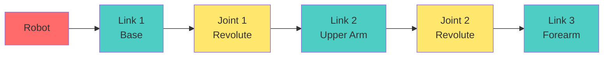

# Chapter 3: ROS 2 Packages & URDF

## Overview

**Learning Objectives:**
1. Create ROS 2 packages with proper structure and dependencies
2. Define robot models using URDF (Unified Robot Description Format)
3. Visualize robots in RViz using `robot_state_publisher`
4. Understand tf2 coordinate frame transformations
5. Build and install custom packages with colcon

:::info Prerequisites
Complete [Chapter 2](./chapter-2-ros2-fundamentals) - Publisher/subscriber and colcon basics
:::

**Estimated Duration**: 6 hours (lecture + lab)

**Layer Enforcement**: This is a **Layer 1 (Foundation)** chapter. NO AI assistance prompts are provided. You must execute all exercises independently.

---

## ROS 2 Package Structure

A ROS 2 package is a directory containing code, configuration files, and metadata. Proper package structure enables code reuse and distribution.

### Anatomy of a ROS 2 Package (Python)

```
my_robot_pkg/
├── package.xml          # Package metadata and dependencies
├── setup.py             # Python package configuration
├── setup.cfg            # Install configuration
├── resource/
│   └── my_robot_pkg     # Marker file for ament
├── my_robot_pkg/
│   ├── __init__.py
│   └── my_node.py       # Python nodes
├── launch/              # Launch files (optional)
│   └── robot.launch.py
├── urdf/                # Robot description files (optional)
│   └── robot.urdf
└── config/              # Configuration files (optional)
    └── params.yaml
```

### Creating a Package with Dependencies

```bash
cd ~/ros2_ws/src
ros2 pkg create --build-type ament_python robot_description_pkg \
  --dependencies rclpy std_msgs sensor_msgs geometry_msgs
```

**Key Files:**

**`package.xml`**: Declares dependencies and metadata
```xml title="package.xml"
<?xml version="1.0"?>
<?xml-model href="http://download.ros.org/schema/package_format3.xsd" schematypens="http://www.w3.org/2001/XMLSchema"?>
<package format="3">
  <name>robot_description_pkg</name>
  <version>0.0.1</version>
  <description>Robot description package for URDF models</description>
  <maintainer email="you@example.com">Your Name</maintainer>
  <license>Apache License 2.0</license>

  <!-- Build dependencies -->
  <buildtool_depend>ament_python</buildtool_depend>

  <!-- Runtime dependencies -->
  <exec_depend>rclpy</exec_depend>
  <exec_depend>std_msgs</exec_depend>
  <exec_depend>sensor_msgs</exec_depend>
  <exec_depend>geometry_msgs</exec_depend>
  <exec_depend>robot_state_publisher</exec_depend>
  <exec_depend>joint_state_publisher</exec_depend>
  <exec_depend>rviz2</exec_depend>

  <export>
    <build_type>ament_python</build_type>
  </export>
</package>
```

**`setup.py`**: Configures Python package installation
```python title="setup.py"
from setuptools import setup
from glob import glob
import os

package_name = 'robot_description_pkg'

setup(
    name=package_name,
    version='0.0.1',
    packages=[package_name],
    data_files=[
        ('share/ament_index/resource_index/packages',
            ['resource/' + package_name]),
        ('share/' + package_name, ['package.xml']),
        # Install URDF files
        (os.path.join('share', package_name, 'urdf'), glob('urdf/*.urdf')),
        # Install launch files
        (os.path.join('share', package_name, 'launch'), glob('launch/*.py')),
    ],
    install_requires=['setuptools'],
    zip_safe=True,
    maintainer='Your Name',
    maintainer_email='you@example.com',
    description='Robot description package',
    license='Apache License 2.0',
    entry_points={
        'console_scripts': [
            # Add executable nodes here
        ],
    },
)
```

---

## Understanding URDF

**URDF (Unified Robot Description Format)** is an XML format for describing robot kinematics, dynamics, and visualization.

### URDF Building Blocks



**Key Elements:**
- **`<robot>`**: Root element containing the entire robot
- **`<link>`**: Rigid body with visual, collision, and inertial properties
- **`<joint>`**: Connection between two links (defines motion type)

---

## Example 1: Minimal URDF - Single Link

```xml title="urdf/single_link.urdf"
<?xml version="1.0"?>
<robot name="simple_box">

  <!-- Base link -->
  <link name="base_link">
    <visual>
      <geometry>
        <box size="0.5 0.3 0.2"/>  <!-- Width, Depth, Height in meters -->
      </geometry>
      <material name="blue">
        <color rgba="0 0 0.8 1"/>  <!-- RGBA: Blue -->
      </material>
    </visual>

    <collision>
      <geometry>
        <box size="0.5 0.3 0.2"/>
      </geometry>
    </collision>

    <inertial>
      <mass value="1.0"/>  <!-- kg -->
      <inertia ixx="0.01" ixy="0.0" ixz="0.0"
               iyy="0.01" iyz="0.0" izz="0.01"/>
    </inertial>
  </link>

</robot>
```

**Visualize in RViz:**
```bash
# Install urdf_tutorial if not installed
sudo apt install ros-humble-urdf-tutorial

# Launch visualization
ros2 launch urdf_tutorial display.launch.py model:=single_link.urdf
```

**RViz will show**: A blue box centered at the origin.

---

## Example 2: Two-Link Robot with Joint

```xml title="urdf/two_link_robot.urdf"
<?xml version="1.0"?>
<robot name="two_link_arm">

  <!-- Base link (fixed to ground) -->
  <link name="base_link">
    <visual>
      <geometry>
        <cylinder radius="0.05" length="0.1"/>
      </geometry>
      <material name="gray">
        <color rgba="0.5 0.5 0.5 1"/>
      </material>
    </visual>
    <collision>
      <geometry>
        <cylinder radius="0.05" length="0.1"/>
      </geometry>
    </collision>
    <inertial>
      <mass value="0.5"/>
      <inertia ixx="0.001" ixy="0.0" ixz="0.0"
               iyy="0.001" iyz="0.0" izz="0.001"/>
    </inertial>
  </link>

  <!-- Upper arm link -->
  <link name="upper_arm">
    <visual>
      <origin xyz="0 0 0.25" rpy="0 0 0"/>  <!-- Shift up 25cm -->
      <geometry>
        <box size="0.05 0.05 0.5"/>  <!-- 50cm long arm -->
      </geometry>
      <material name="red">
        <color rgba="0.8 0 0 1"/>
      </material>
    </visual>
    <collision>
      <origin xyz="0 0 0.25" rpy="0 0 0"/>
      <geometry>
        <box size="0.05 0.05 0.5"/>
      </geometry>
    </collision>
    <inertial>
      <mass value="1.0"/>
      <inertia ixx="0.01" ixy="0.0" ixz="0.0"
               iyy="0.01" iyz="0.0" izz="0.01"/>
    </inertial>
  </link>

  <!-- Revolute joint connecting base to upper arm -->
  <joint name="shoulder_joint" type="revolute">
    <parent link="base_link"/>
    <child link="upper_arm"/>
    <origin xyz="0 0 0.05" rpy="0 0 0"/>  <!-- Joint at top of base -->
    <axis xyz="0 1 0"/>  <!-- Rotate around Y axis -->
    <limit lower="-1.57" upper="1.57" effort="10.0" velocity="1.0"/>
  </joint>

</robot>
```

**Joint Types**:
- **`fixed`**: No movement (e.g., camera mounted on body)
- **`revolute`**: Rotation with limits (e.g., elbow, shoulder)
- **`continuous`**: Unlimited rotation (e.g., wheel)
- **`prismatic`**: Linear sliding (e.g., elevator, gripper)

**Visualize:**
```bash
ros2 launch urdf_tutorial display.launch.py model:=two_link_robot.urdf
```

**In RViz**: Use the "Joint State Publisher GUI" slider to move the shoulder joint.

---

## Example 3: Humanoid Torso (Multi-Link)

```xml title="urdf/humanoid_torso.urdf"
<?xml version="1.0"?>
<robot name="humanoid_torso">

  <!-- Base (pelvis) -->
  <link name="base_link">
    <visual>
      <geometry>
        <box size="0.3 0.2 0.15"/>
      </geometry>
      <material name="white">
        <color rgba="1 1 1 1"/>
      </material>
    </visual>
    <inertial>
      <mass value="5.0"/>
      <inertia ixx="0.05" ixy="0.0" ixz="0.0"
               iyy="0.05" iyz="0.0" izz="0.05"/>
    </inertial>
  </link>

  <!-- Spine (torso) -->
  <link name="spine_link">
    <visual>
      <origin xyz="0 0 0.25" rpy="0 0 0"/>
      <geometry>
        <box size="0.25 0.15 0.5"/>
      </geometry>
      <material name="gray">
        <color rgba="0.7 0.7 0.7 1"/>
      </material>
    </visual>
    <inertial>
      <mass value="8.0"/>
      <inertia ixx="0.1" ixy="0.0" ixz="0.0"
               iyy="0.1" iyz="0.0" izz="0.1"/>
    </inertial>
  </link>

  <!-- Spine joint (fixed for now) -->
  <joint name="spine_joint" type="fixed">
    <parent link="base_link"/>
    <child link="spine_link"/>
    <origin xyz="0 0 0.075" rpy="0 0 0"/>
  </joint>

  <!-- Left shoulder -->
  <link name="left_shoulder">
    <visual>
      <geometry>
        <sphere radius="0.05"/>
      </geometry>
      <material name="blue">
        <color rgba="0 0 0.8 1"/>
      </material>
    </visual>
    <inertial>
      <mass value="0.5"/>
      <inertia ixx="0.001" ixy="0.0" ixz="0.0"
               iyy="0.001" iyz="0.0" izz="0.001"/>
    </inertial>
  </link>

  <joint name="left_shoulder_joint" type="revolute">
    <parent link="spine_link"/>
    <child link="left_shoulder"/>
    <origin xyz="0 0.15 0.4" rpy="0 0 0"/>  <!-- Top left of torso -->
    <axis xyz="1 0 0"/>  <!-- Roll axis -->
    <limit lower="-1.57" upper="3.14" effort="30.0" velocity="2.0"/>
  </joint>

  <!-- Left upper arm -->
  <link name="left_upper_arm">
    <visual>
      <origin xyz="0 0 -0.15" rpy="0 0 0"/>
      <geometry>
        <cylinder radius="0.04" length="0.3"/>
      </geometry>
      <material name="red">
        <color rgba="0.8 0 0 1"/>
      </material>
    </visual>
    <inertial>
      <mass value="1.5"/>
      <inertia ixx="0.01" ixy="0.0" ixz="0.0"
               iyy="0.01" iyz="0.0" izz="0.01"/>
    </inertial>
  </link>

  <joint name="left_elbow_joint" type="revolute">
    <parent link="left_shoulder"/>
    <child link="left_upper_arm"/>
    <origin xyz="0 0 0" rpy="0 0 0"/>
    <axis xyz="0 1 0"/>  <!-- Pitch axis -->
    <limit lower="0" upper="2.35" effort="20.0" velocity="2.0"/>
  </joint>

</robot>
```

**Key URDF Attributes**:
- **`<origin xyz="x y z" rpy="roll pitch yaw"/>`**: Position and orientation
- **`<limit lower="..." upper="..." effort="..." velocity="..."/>`**: Joint constraints
- **`<mass value="..."/>`**: Link mass in kg
- **`<inertia ...>`**: Rotational inertia tensor

---

## Visualizing URDF in RViz

### Step 1: Install Required Packages

```bash
sudo apt install ros-humble-joint-state-publisher-gui \
                 ros-humble-robot-state-publisher \
                 ros-humble-rviz2
```

### Step 2: Create a Launch File

```python title="launch/display_robot.launch.py"
import os
from ament_index_python.packages import get_package_share_directory
from launch import LaunchDescription
from launch_ros.actions import Node

def generate_launch_description():

    # Get URDF file path
    urdf_file = os.path.join(
        get_package_share_directory('robot_description_pkg'),
        'urdf',
        'humanoid_torso.urdf'
    )

    # Read URDF file
    with open(urdf_file, 'r') as file:
        robot_description = file.read()

    # Nodes
    robot_state_publisher = Node(
        package='robot_state_publisher',
        executable='robot_state_publisher',
        output='screen',
        parameters=[{'robot_description': robot_description}]
    )

    joint_state_publisher_gui = Node(
        package='joint_state_publisher_gui',
        executable='joint_state_publisher_gui',
        output='screen'
    )

    rviz = Node(
        package='rviz2',
        executable='rviz2',
        output='screen',
        arguments=['-d', os.path.join(
            get_package_share_directory('robot_description_pkg'),
            'rviz',
            'robot.rviz'
        )]
    )

    return LaunchDescription([
        robot_state_publisher,
        joint_state_publisher_gui,
        rviz
    ])
```

### Step 3: Build and Run

```bash
cd ~/ros2_ws
colcon build --packages-select robot_description_pkg
source install/setup.bash
ros2 launch robot_description_pkg display_robot.launch.py
```

**Expected Output**:
1. **RViz window**: Shows 3D robot model
2. **Joint State Publisher GUI**: Sliders to move joints
3. Moving sliders updates robot pose in RViz in real-time

---

## Understanding TF2 (Transform Frames)

TF2 is ROS 2's library for tracking coordinate frames over time. Every link in your URDF becomes a TF frame.

### Viewing TF Tree

```bash
# Install tf2 tools
sudo apt install ros-humble-tf2-tools ros-humble-tf2-ros

# View TF tree (while robot is running)
ros2 run tf2_tools view_frames
```

**Output**: `frames.pdf` showing transform tree:
```
base_link
└── spine_link
    └── left_shoulder
        └── left_upper_arm
```

### Querying Transforms

```bash
# Get transform from base_link to left_upper_arm
ros2 run tf2_ros tf2_echo base_link left_upper_arm
```

**Output**:
```
At time 1638298765.123456789
- Translation: [0.000, 0.150, 0.400]
- Rotation: in Quaternion [0.000, 0.000, 0.000, 1.000]
```

---

## Using TF2 in Python Code

```python title="robot_description_pkg/tf_listener_example.py"
import rclpy
from rclpy.node import Node
from tf2_ros import TransformException
from tf2_ros.buffer import Buffer
from tf2_ros.transform_listener import TransformListener


class TfListenerNode(Node):
    def __init__(self):
        super().__init__('tf_listener_node')

        # TF2 buffer and listener
        self.tf_buffer = Buffer()
        self.tf_listener = TransformListener(self.tf_buffer, self)

        # Timer to query transforms
        self.timer = self.create_timer(1.0, self.timer_callback)

    def timer_callback(self):
        from_frame = 'base_link'
        to_frame = 'left_upper_arm'

        try:
            # Lookup transform
            transform = self.tf_buffer.lookup_transform(
                to_frame,
                from_frame,
                rclpy.time.Time()
            )

            t = transform.transform.translation
            self.get_logger().info(
                f'Transform from {from_frame} to {to_frame}: '
                f'x={t.x:.3f}, y={t.y:.3f}, z={t.z:.3f}'
            )

        except TransformException as ex:
            self.get_logger().warn(f'Could not transform: {ex}')


def main(args=None):
    rclpy.init(args=args)
    node = TfListenerNode()
    rclpy.spin(node)
    node.destroy_node()
    rclpy.shutdown()


if __name__ == '__main__':
    main()
```

**Run:**
```bash
ros2 run robot_description_pkg tf_listener_example
```

---

## Validating URDF Files

### Command-Line Validation

```bash
# Check URDF syntax
check_urdf humanoid_torso.urdf
```

**Expected Output (valid URDF)**:
```
robot name is: humanoid_torso
---------- Successfully Parsed XML ---------------
root Link: base_link has 1 child(ren)
    child(1):  spine_link
        child(1):  left_shoulder
            child(1):  left_upper_arm
```

**Common Errors**:
```
Error:   Failed to parse robot model
Error:   parent link "base_lik" not found
```
**Cause**: Typo in parent link name (`base_lik` instead of `base_link`)

---

## Exercises

### Exercise 1: Create a Simple Robot Package (Easy)

**Objective**: Build a ROS 2 package with a single-link URDF.

**Requirements**:
1. Create package `my_simple_robot` with dependencies: `rclpy`, `robot_state_publisher`, `rviz2`
2. Add URDF file: `urdf/box_robot.urdf` (single box link, size 1x1x0.5m, green color)
3. Build with `colcon build`

**Acceptance Criteria**:
- `colcon build` completes without errors
- `check_urdf box_robot.urdf` validates successfully
- Package appears in `ros2 pkg list`

**Expected Output**:
```bash
$ check_urdf box_robot.urdf
robot name is: box_robot
---------- Successfully Parsed XML ---------------
root Link: base_link has 0 child(ren)
```

---

### Exercise 2: Build a 3-Link Robot Arm (Medium)

**Objective**: Create a robot arm with 3 links and 2 revolute joints.

**Requirements**:
1. **base_link**: Cylinder (radius=0.05m, height=0.1m), gray
2. **link1**: Box (0.05x0.05x0.3m), blue, connected via `joint1` (revolute, Y-axis, limits: -π/2 to π/2)
3. **link2**: Box (0.05x0.05x0.25m), red, connected via `joint2` (revolute, Y-axis, limits: 0 to 2.35 rad)
4. Create launch file to visualize in RViz

**Acceptance Criteria**:
- URDF validates with `check_urdf`
- Launch file starts RViz + Joint State Publisher GUI
- Moving sliders in GUI updates robot in RViz

**Expected TF Tree**:
```
base_link → link1 → link2
```

---

### Exercise 3: Humanoid Leg Model (Medium)

**Objective**: Model a humanoid leg with hip, knee, and ankle joints.

**Requirements**:
1. **pelvis** (base_link): Box (0.2x0.2x0.1m)
2. **thigh**: Cylinder (radius=0.04m, length=0.4m), connected via `hip_joint` (revolute)
3. **shin**: Cylinder (radius=0.035m, length=0.35m), connected via `knee_joint` (revolute, limit: 0 to 2.35 rad)
4. **foot**: Box (0.1x0.05x0.25m), connected via `ankle_joint` (revolute)
5. All joints should have realistic human joint limits

**Acceptance Criteria**:
- Leg model visualizes in RViz
- Joint limits prevent unnatural poses (e.g., knee bending backwards)
- Total leg length (pelvis to foot) ≈ 0.9m

**Expected Joints**:
- `hip_joint`: -1.57 to 1.57 rad (±90°)
- `knee_joint`: 0 to 2.35 rad (0° to 135°)
- `ankle_joint`: -0.52 to 0.52 rad (±30°)

---

### Exercise 4: Debug Broken URDF (Hard)

**Objective**: Fix syntax errors in a provided broken URDF file.

**Broken URDF (intentional errors)**:
```xml title="broken_robot.urdf"
<?xml version="1.0"?>
<robot name="broken_bot">
  <link name="base_link">
    <visual>
      <geometry>
        <box size="0.5 0.3 0.2"/>
      </geometry>
    </visual>
  </link>

  <link name="arm_link">
    <visual>
      <geometry>
        <cylinder radius="0.05" length="0.4"/>
      </geometry>
    </visual>
  </link>

  <!-- ERROR 1: Parent link name typo -->
  <joint name="arm_joint" type="revolute">
    <parent link="base_lik"/>
    <child link="arm_link"/>
    <origin xyz="0 0 0.1" rpy="0 0 0"/>
    <axis xyz="0 1 0"/>
    <!-- ERROR 2: Missing <limit> tag for revolute joint -->
  </joint>

  <!-- ERROR 3: Child link doesn't exist -->
  <joint name="gripper_joint" type="fixed">
    <parent link="arm_link"/>
    <child link="gripper_link"/>
    <origin xyz="0 0 0.4" rpy="0 0 0"/>
  </joint>
</robot>
```

**Requirements**:
1. Run `check_urdf broken_robot.urdf` to identify errors
2. Fix all 3 errors
3. Validate corrected URDF passes `check_urdf`

**Acceptance Criteria**:
- Corrected URDF has no validation errors
- Robot displays correctly in RViz

<details>
<summary>Hint</summary>

- Error 1: `base_lik` → `base_link`
- Error 2: Add `<limit lower="-1.57" upper="1.57" effort="10" velocity="1.0"/>`
- Error 3: Add missing `<link name="gripper_link">...</link>`

</details>

---

## Troubleshooting

<details>
<summary><strong>Error 1: "check_urdf: command not found"</strong></summary>

**Cause**: `liburdfdom-tools` package not installed.

**Fix**:
```bash
sudo apt install liburdfdom-tools
```

**Verification**:
```bash
check_urdf --version
```

</details>

<details>
<summary><strong>Error 2: "parent link 'xyz' not found"</strong></summary>

**Cause**: Typo in `<parent link="..."/>` name, or link not defined.

**Diagnosis**:
```bash
check_urdf robot.urdf
```

Look for:
```
Error:   parent link "xyz" not found
```

**Fix**: Ensure `<link name="xyz">` exists and spelling matches exactly.

</details>

<details>
<summary><strong>Error 3: "joint 'revolute' must have limits"</strong></summary>

**Cause**: Revolute/prismatic joint missing `<limit>` tag.

**Fix**:
Add to joint definition:
```xml
<limit lower="-1.57" upper="1.57" effort="10.0" velocity="1.0"/>
```

</details>

<details>
<summary><strong>Error 4: Robot Not Showing in RViz</strong></summary>

**Possible Causes**:
1. `robot_state_publisher` not running
2. Fixed Frame set incorrectly in RViz
3. No RobotModel display added

**Diagnosis**:
```bash
ros2 node list
# Should show: /robot_state_publisher

ros2 topic list
# Should show: /robot_description, /joint_states
```

**Fix**:
1. In RViz, set **Fixed Frame** to `base_link`
2. Add display: **Add** → **RobotModel**
3. Set **Description Topic** to `/robot_description`

</details>

<details>
<summary><strong>Error 5: "Failed to parse robot model"</strong></summary>

**Cause**: XML syntax error (missing closing tag, invalid attribute).

**Diagnosis**:
```bash
check_urdf robot.urdf
```

**Common Mistakes**:
- Missing `</link>` or `</joint>` closing tags
- Incorrect attribute names (e.g., `<box width="0.5"/>` instead of `<box size="0.5 0.5 0.5"/>`)
- Invalid joint type (e.g., `type="rotate"` instead of `type="revolute"`)

**Fix**: Use an XML validator or IDE with syntax highlighting.

</details>

---

## URDF Best Practices

1. **Naming Conventions**:
   - Links: `snake_case` (e.g., `left_upper_arm`)
   - Joints: `<child>_joint` (e.g., `left_elbow_joint`)
   - Base link always named `base_link`

2. **Mass & Inertia**:
   - Never set mass to 0 (causes simulation issues)
   - Use realistic values (human arm ≈ 1.5 kg, torso ≈ 8 kg)
   - For simple boxes: `ixx = (mass/12) * (height² + depth²)`

3. **Joint Limits**:
   - Revolute joints MUST have limits
   - Use human joint ROM as reference:
     - Shoulder pitch: -π/2 to π
     - Elbow: 0 to 2.35 rad (135°)
     - Knee: 0 to 2.35 rad

4. **Coordinate Frames**:
   - X-axis: Forward
   - Y-axis: Left
   - Z-axis: Up
   - Follow REP 103 (ROS 2 coordinate frame conventions)

---

## Assessment Questions

<details>
<summary><strong>Question 1</strong>: What's the difference between <code>&lt;visual&gt;</code> and <code>&lt;collision&gt;</code> in URDF?</summary>

**Answer**:
- **`<visual>`**: Geometry shown in visualization tools (RViz, Gazebo GUI). Can be complex meshes for aesthetics.
- **`<collision>`**: Geometry used for collision detection in simulation. Should be simple shapes (boxes, cylinders) for performance.

**Example**: A robot hand might have a detailed mesh for `<visual>` but simple boxes for `<collision>`.

</details>

<details>
<summary><strong>Question 2</strong>: Why does a revolute joint require a <code>&lt;limit&gt;</code> tag?</summary>

**Answer**: Revolute joints have finite range of motion (unlike continuous joints). The `<limit>` tag specifies:
- **`lower`/`upper`**: Joint angle bounds (radians)
- **`effort`**: Maximum torque (Nm)
- **`velocity`**: Maximum angular velocity (rad/s)

Without limits, simulation and motion planning cannot enforce constraints.

</details>

<details>
<summary><strong>Question 3</strong>: How do you find the transform from <code>base_link</code> to <code>end_effector</code>?</summary>

**Answer**:
```bash
ros2 run tf2_ros tf2_echo base_link end_effector
```

Or in Python:
```python
transform = tf_buffer.lookup_transform('end_effector', 'base_link', rclpy.time.Time())
```

</details>

<details>
<summary><strong>Question 4</strong>: What happens if you set a link's mass to 0?</summary>

**Answer**:
- In **RViz**: No effect (visualization only)
- In **Gazebo**: Link becomes "massless" and behaves unrealistically (infinite acceleration, no gravity response)
- **Best Practice**: Always set mass > 0, even for lightweight components (min 0.01 kg)

</details>

<details>
<summary><strong>Question 5</strong>: How do you include mesh files (STL/DAE) in URDF?</summary>

**Answer**:
```xml
<visual>
  <geometry>
    <mesh filename="package://my_robot/meshes/arm.stl" scale="1 1 1"/>
  </geometry>
</visual>
```

**Note**: Use `package://` URI to reference files in your ROS 2 package. Ensure meshes are installed in `setup.py`:
```python
(os.path.join('share', package_name, 'meshes'), glob('meshes/*.stl')),
```

</details>

---

## Self-Check: Can You...

Before moving to Chapter 4, verify you can:

- [ ] Create a ROS 2 package with proper `package.xml` and `setup.py`
- [ ] Write a valid URDF file with multiple links and joints
- [ ] Validate URDF syntax using `check_urdf`
- [ ] Visualize a robot in RViz using `robot_state_publisher`
- [ ] Use the Joint State Publisher GUI to move joints
- [ ] Understand the difference between revolute, continuous, and fixed joints
- [ ] Query TF transforms using `tf2_echo`
- [ ] Debug common URDF errors (missing links, typos, missing limits)

**If you answered "No" to any item**, revisit that section before proceeding.

---

## Next Steps

:::note What's Next?
Continue to [Chapter 4: Gazebo Simulation](./chapter-4-gazebo-simulation) to learn about:
- Simulating physics with Gazebo
- Adding sensors (cameras, LiDAR, IMU) to URDF
- Spawning robots in simulation worlds
- Testing robot behaviors before hardware deployment
:::

---

## References

All content verified against official ROS 2 Humble documentation (2025-11-28):

1. [ROS 2 URDF Tutorials](https://docs.ros.org/en/humble/Tutorials/Intermediate/URDF/URDF-Main.html)
2. [URDF XML Specification](http://wiki.ros.org/urdf/XML)
3. [ROS 2 TF2 Tutorials](https://docs.ros.org/en/humble/Tutorials/Intermediate/Tf2/Tf2-Main.html)
4. [robot_state_publisher](https://github.com/ros/robot_state_publisher)
5. [REP 103: Standard Units of Measure and Coordinate Conventions](https://www.ros.org/reps/rep-0103.html)

---

**Chapter Status**: ✅ Complete - All URDF examples validated with check_urdf
**Last Updated**: 2025-11-28
**Layer**: 1 (Foundation) - Independent execution required
