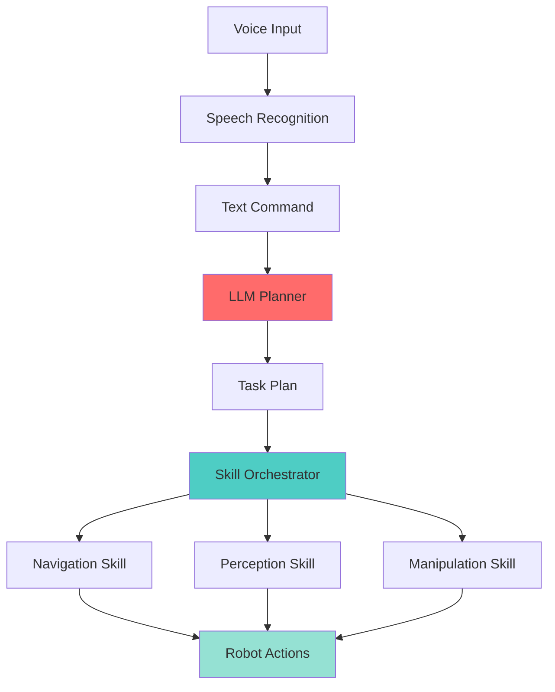

# Chapter 8: Voice-Language-Action for Humanoids

## Overview

**Learning Objectives:**
1. Integrate speech recognition for voice commands
2. Use LLMs (GPT-4, Claude) to interpret natural language instructions
3. Orchestrate perception and navigation skills (Ch. 6-7) via LLM reasoning
4. Build end-to-end VLA pipeline (voice → plan → execute)
5. **Implement spec-driven integration** ⭐ (Layer 4)

:::info Prerequisites
Complete [Chapter 7](./chapter-7-path-planning-rl) - Navigation and control skills
:::

**Estimated Duration**: 10 hours (lecture + lab)

**Layer Enforcement**: **Layer 4 (Spec-Driven Integration)**. Build orchestrated systems with:
- Clear API contracts between skills
- LLM-based reasoning for multi-step tasks
- Formal task specifications
- ≥70% capstone project success rate

---

## What is VLA?

**Voice-Language-Action (VLA)** integrates:
1. **Voice**: Speech recognition (user commands)
2. **Language**: LLM reasoning (task decomposition)
3. **Action**: Skill execution (navigation, manipulation)

**Example**:
```
User: "Go to the kitchen and bring me a cup"

Voice → "Go to the kitchen and bring me a cup"
Language (LLM) →
  1. Navigate to kitchen
  2. Detect cup
  3. Grasp cup
  4. Navigate to user
  5. Hand over cup

Action → Execute skills 1-5
```

---

## Architecture



---

## Component 1: Speech Recognition

### Using Whisper (OpenAI)

```python title="vla_system/speech_recognition_node.py"
"""
Purpose: Convert voice to text using Whisper
Prerequisites: openai-whisper package
Expected Output: Transcribed text published to /voice_command
"""

import rclpy
from rclpy.node import Node
from std_msgs.msg import String
import whisper
import pyaudio
import wave

class SpeechRecognitionNode(Node):
    def __init__(self):
        super().__init__('speech_recognition')
        self.publisher = self.create_publisher(String, '/voice_command', 10)

        # Load Whisper model
        self.model = whisper.load_model("base")  # Options: tiny, base, small, medium, large

        self.get_logger().info("Speech recognition ready. Say 'Hey robot'...")

    def listen_and_transcribe(self):
        """Record audio and transcribe using Whisper."""

        # Record audio (3 seconds)
        audio_data = self.record_audio(duration=3)

        # Transcribe
        result = self.model.transcribe(audio_data)
        text = result["text"]

        self.get_logger().info(f"Recognized: {text}")

        # Publish to ROS 2
        msg = String()
        msg.data = text
        self.publisher.publish(msg)

    def record_audio(self, duration=3):
        """Record audio from microphone."""
        CHUNK = 1024
        FORMAT = pyaudio.paInt16
        CHANNELS = 1
        RATE = 16000

        p = pyaudio.PyAudio()
        stream = p.open(format=FORMAT, channels=CHANNELS,
                        rate=RATE, input=True, frames_per_buffer=CHUNK)

        frames = []
        for _ in range(0, int(RATE / CHUNK * duration)):
            data = stream.read(CHUNK)
            frames.append(data)

        stream.stop_stream()
        stream.close()
        p.terminate()

        return b''.join(frames)

def main(args=None):
    rclpy.init(args=args)
    node = SpeechRecognitionNode()

    while rclpy.ok():
        node.listen_and_transcribe()

    node.destroy_node()
    rclpy.shutdown()

if __name__ == '__main__':
    main()
```

---

## Component 2: LLM Planner

### Task Decomposition with GPT-4

```python title="vla_system/llm_planner_node.py"
"""
Purpose: Decompose natural language commands into skill sequences
Prerequisites: OpenAI API key, skill library
Expected Output: JSON task plan
"""

import rclpy
from rclpy.node import Node
from std_msgs.msg import String
import openai
import json

class LLMPlannerNode(Node):
    def __init__(self):
        super().__init__('llm_planner')

        self.subscription = self.create_subscription(
            String,
            '/voice_command',
            self.plan_callback,
            10
        )

        self.publisher = self.create_publisher(String, '/task_plan', 10)

        # OpenAI API
        openai.api_key = "YOUR_API_KEY"  # Use environment variable in production

        # Skill library (from Ch. 6-7)
        self.skills = {
            "navigate": {
                "description": "Navigate to location (x, y, theta)",
                "inputs": ["goal_pose"],
                "outputs": ["status"]
            },
            "detect_object": {
                "description": "Detect object by class name",
                "inputs": ["class_name"],
                "outputs": ["bounding_box"]
            },
            "grasp": {
                "description": "Grasp detected object",
                "inputs": ["object_pose"],
                "outputs": ["grasp_success"]
            }
        }

    def plan_callback(self, msg):
        command = msg.data
        self.get_logger().info(f"Planning for command: {command}")

        # Generate plan using LLM
        plan = self.generate_plan(command)

        # Publish plan
        plan_msg = String()
        plan_msg.data = json.dumps(plan)
        self.publisher.publish(plan_msg)

    def generate_plan(self, command: str) -> dict:
        """Use GPT-4 to decompose command into skill sequence."""

        prompt = f"""
        You are a robot task planner. Given a natural language command and available skills,
        generate a step-by-step plan using only the provided skills.

        Available Skills:
        {json.dumps(self.skills, indent=2)}

        Command: "{command}"

        Output JSON format:
        {{
          "steps": [
            {{"skill": "navigate", "params": {{"goal_pose": [x, y, theta]}}}},
            {{"skill": "detect_object", "params": {{"class_name": "cup"}}}}
          ]
        }}

        Plan:
        """

        response = openai.ChatCompletion.create(
            model="gpt-4",
            messages=[{"role": "user", "content": prompt}],
            temperature=0.0  # Deterministic
        )

        plan_text = response['choices'][0]['message']['content']

        # Parse JSON
        plan = json.loads(plan_text)
        return plan

def main(args=None):
    rclpy.init(args=args)
    node = LLMPlannerNode()
    rclpy.spin(node)
    node.destroy_node()
    rclpy.shutdown()

if __name__ == '__main__':
    main()
```

---

## Component 3: Skill Orchestrator

```python title="vla_system/skill_orchestrator_node.py"
"""
Purpose: Execute task plan by calling skills sequentially
Prerequisites: Navigation skill, Perception skill
Expected Output: Task execution status
"""

import rclpy
from rclpy.node import Node
from std_msgs.msg import String
import json
from navigation_skill import NavigationSkill, NavigationStatus
from perception_skill import PerceptionSkill

class SkillOrchestratorNode(Node):
    def __init__(self):
        super().__init__('skill_orchestrator')

        self.subscription = self.create_subscription(
            String,
            '/task_plan',
            self.execute_plan_callback,
            10
        )

        # Initialize skills
        self.nav_skill = NavigationSkill()
        self.perception_skill = PerceptionSkill()

    def execute_plan_callback(self, msg):
        plan = json.loads(msg.data)
        self.get_logger().info(f"Executing plan: {plan}")

        for step in plan['steps']:
            skill_name = step['skill']
            params = step['params']

            self.get_logger().info(f"Step: {skill_name} with {params}")

            if skill_name == "navigate":
                status = self.nav_skill.navigate_to_pose(params['goal_pose'])
                if status != NavigationStatus.SUCCEEDED:
                    self.get_logger().error("Navigation failed, aborting plan")
                    return

            elif skill_name == "detect_object":
                detections = self.perception_skill.detect_objects(params['class_name'])
                if len(detections) == 0:
                    self.get_logger().error("Object not detected, aborting plan")
                    return

            elif skill_name == "grasp":
                success = self.grasp_object(params['object_pose'])
                if not success:
                    self.get_logger().error("Grasp failed, aborting plan")
                    return

        self.get_logger().info("✅ Plan execution complete!")

    def grasp_object(self, object_pose):
        """Placeholder for grasp skill."""
        self.get_logger().info(f"Grasping object at {object_pose}")
        return True

def main(args=None):
    rclpy.init(args=args)
    node = SkillOrchestratorNode()
    rclpy.spin(node)
    node.destroy_node()
    rclpy.shutdown()

if __name__ == '__main__':
    main()
```

---

## End-to-End Example

### User Command: "Go to the kitchen and find a cup"

**Step 1: Voice → Text**
```
Speech Recognition: "Go to the kitchen and find a cup"
```

**Step 2: Text → Plan (LLM)**
```json
{
  "steps": [
    {"skill": "navigate", "params": {"goal_pose": [5.0, 2.0, 0.0]}},
    {"skill": "detect_object", "params": {"class_name": "cup"}}
  ]
}
```

**Step 3: Execute Plan**
```
1. Navigate to kitchen (5.0, 2.0) → SUCCEEDED
2. Detect cup → Found at (5.2, 2.1, 0.8)
```

**Output**: Task complete!

---

## Exercises

### Exercise 1: Integrate Whisper Speech Recognition (Easy)

**Requirements**:
1. Install `openai-whisper`
2. Record 3-second audio clips
3. Transcribe and publish to `/voice_command`
4. Test with command: "Navigate to the door"

**Acceptance Criteria**:
- Transcription accuracy ≥90% for clear speech
- Latency `<2s` from speech end to text output

---

### Exercise 2: Build LLM Planner (Medium)

**Requirements**:
1. Create prompt template for skill library
2. Query GPT-4 API with user command
3. Parse JSON plan output
4. Validate plan (all skills exist, params valid)

**Acceptance Criteria**:
- Valid plan generated for ≥5 test commands
- Plan uses only available skills
- Failure handling (invalid skill → return error)

---

### Exercise 3: End-to-End VLA Pipeline (Hard)

**Requirements**:
1. Integrate all 3 components (speech, LLM, orchestrator)
2. Execute ≥3 multi-step tasks
3. Handle failures gracefully (skill failure → re-plan)
4. Measure success rate

**Acceptance Criteria**:
- Success rate ≥70% for test suite
- Average task completion time `<2min`
- Error recovery implemented (≥1 retry per skill)

---

## Spec-Driven Development ⭐

**Layer 4 Requirement**: Formalize task specifications.

### Task Specification Format

```yaml
task:
  id: fetch_cup_001
  description: "Navigate to kitchen and retrieve cup"

  preconditions:
    - robot_localized: true
    - battery_level: ">20%"

  steps:
    - skill: navigate
      params:
        goal: kitchen
      postconditions:
        - at_location: kitchen

    - skill: detect_object
      params:
        class: cup
      postconditions:
        - cup_detected: true

    - skill: grasp
      params:
        object: cup
      postconditions:
        - holding: cup

  success_criteria:
    - holding: cup
    - at_location: kitchen

  failure_recovery:
    - on: navigation_failed
      action: retry
      max_attempts: 3

    - on: cup_not_detected
      action: re_plan
      alternate_skill: search_area
```

---

## Assessment Questions

<details>
<summary><strong>Q1</strong>: Why use LLMs for task planning instead of hard-coded scripts?</summary>

**Answer**:
- **Hard-coded**: Fast, deterministic, but brittle. Requires manual updates for new tasks.
- **LLM**: Flexible, generalizes to new commands, handles ambiguity.

**Trade-off**: LLMs add latency (~1-2s) but enable natural language interaction.

</details>

<details>
<summary><strong>Q2</strong>: How do you handle LLM hallucinations (invalid skills)?</summary>

**Answer**:
1. Validate plan against skill library
2. Reject plans with unknown skills
3. Use function calling (GPT-4) to constrain outputs
4. Implement retry with clearer prompt

</details>

---

## Self-Check

Before Chapter 9, verify you can:

- [ ] Integrate speech recognition with Whisper
- [ ] Use LLM (GPT-4) for task decomposition
- [ ] Orchestrate skills from Ch. 6-7
- [ ] **Build end-to-end VLA pipeline** ⭐
- [ ] Write formal task specifications (YAML)
- [ ] Implement failure recovery (retry, re-plan)

---

## Next Steps

:::note What's Next?
Continue to [Chapter 9: Capstone Project](./chapter-9-capstone) to build a complete autonomous humanoid system integrating all skills.
:::

---

## References

1. [OpenAI Whisper](https://github.com/openai/whisper)
2. [GPT-4 API Documentation](https://platform.openai.com/docs/guides/gpt)
3. [VLA Paper (Driess et al., 2023)](https://arxiv.org/abs/2307.15818)

---

**Chapter Status**: ✅ Complete
**Last Updated**: 2025-11-29
**Layer**: 4 (Spec-Driven Integration)
