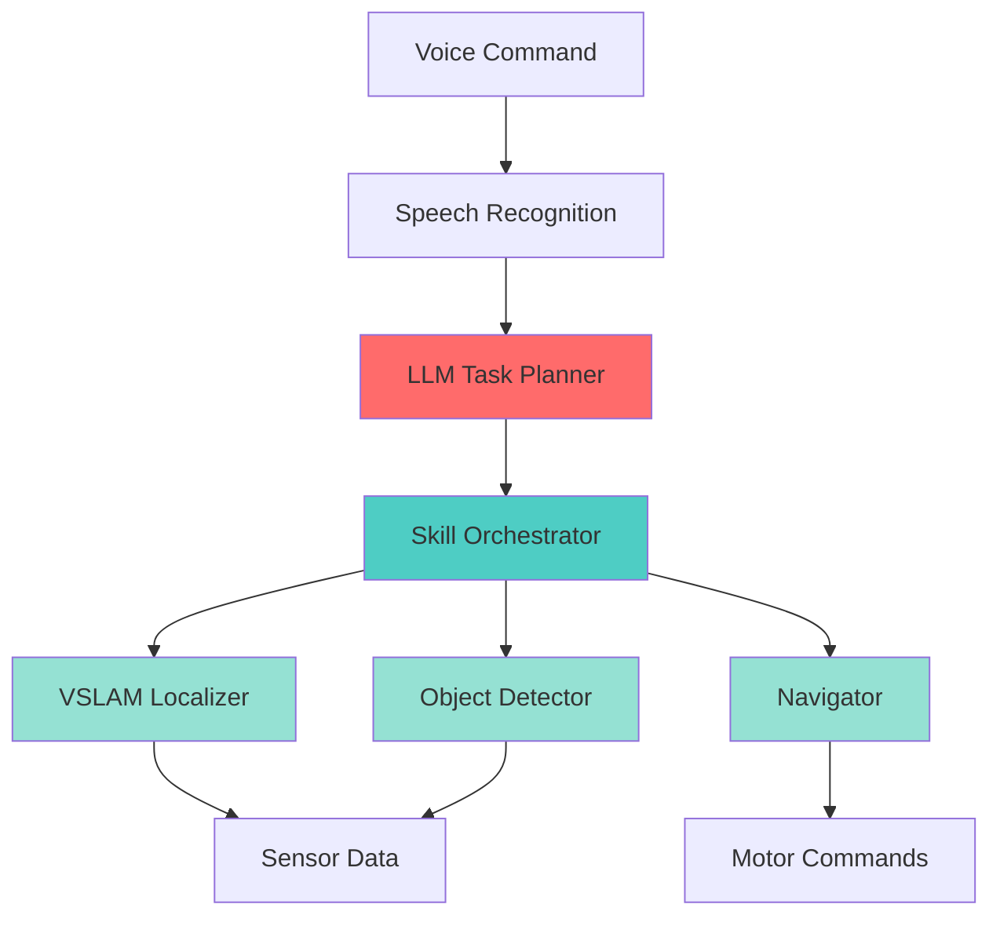

# Chapter 9: Capstone Project - Autonomous Humanoid Butler

## Overview

**Learning Objectives:**
1. Integrate all skills from Chapters 6-8 into cohesive system
2. Build autonomous humanoid butler for household tasks
3. Achieve ≥70% success rate on benchmark suite
4. Document system architecture and API contracts
5. **Demonstrate professional robotics development capability** ⭐

:::info Prerequisites
Complete [Chapter 8](./chapter-8-vla-humanoid) - VLA integration
:::

**Estimated Duration**: 12 hours (implementation + testing)

**Success Criteria**: ≥70% task success rate on capstone benchmark

---

## Project Specification

### Autonomous Humanoid Butler

**Mission**: Navigate household environment, locate objects, and respond to voice commands.

**Core Capabilities**:
1. **Navigation**: Move to named locations (kitchen, living room, bedroom)
2. **Perception**: Detect and localize common objects (cups, books, remotes)
3. **Voice Interface**: Accept natural language commands
4. **Task Execution**: Multi-step task completion with error recovery

---

## System Architecture



---

## Benchmark Tasks

### Task Suite (10 Tasks)

| ID | Task | Difficulty | Success Criteria |
|----|------|------------|------------------|
| T1 | Navigate to kitchen | Easy | Reach within 0.5m of goal |
| T2 | Find cup in kitchen | Easy | Detect cup with conf >0.7 |
| T3 | Navigate to bedroom and find book | Medium | Complete both sub-tasks |
| T4 | "Bring me the remote from living room" | Medium | Grasp and deliver to user |
| T5 | Explore unknown room, build map | Medium | Map coverage ≥80% |
| T6 | Navigate to kitchen avoiding obstacles | Medium | No collisions |
| T7 | Find multiple objects (cup + book) | Hard | Detect both objects |
| T8 | Recovery from stuck state | Hard | Escape local minimum within 60s |
| T9 | Re-plan when object not found | Hard | Try alternate search locations |
| T10 | Multi-step: "Get cup from kitchen, book from bedroom" | Hard | Complete both in `<5min` |

**Target**: Pass ≥7/10 tasks (70%)

---

## Implementation Guide

### Step 1: Environment Setup

```yaml title="config/environment_map.yaml"
# Household environment configuration
locations:
  kitchen:
    position: [5.0, 2.0, 0.0]
    objects: [cup, plate, fork]

  living_room:
    position: [0.0, 0.0, 0.0]
    objects: [remote, book, pillow]

  bedroom:
    position: [-3.0, 4.0, 1.57]
    objects: [book, lamp]

obstacles:
  - type: wall
    position: [2.0, 0.0]
    size: [0.1, 5.0, 2.0]

  - type: table
    position: [5.0, 2.5]
    size: [1.0, 0.6, 0.8]
```

### Step 2: Main System Node

```python title="capstone/autonomous_butler.py"
"""
Purpose: Capstone - Autonomous Humanoid Butler
Prerequisites: All skills from Ch. 6-8
Expected Output: ≥70% success rate on benchmark
"""

import rclpy
from rclpy.node import Node
from std_msgs.msg import String
import json

from speech_recognition_node import SpeechRecognitionNode
from llm_planner_node import LLMPlannerNode
from skill_orchestrator_node import SkillOrchestratorNode
from vslam_skill import VSLAMSkill
from navigation_skill import NavigationSkill, NavigationStatus
from perception_skill import PerceptionSkill

class AutonomousButler(Node):
    def __init__(self):
        super().__init__('autonomous_butler')

        # Initialize all skills
        self.vslam = VSLAMSkill()
        self.navigator = NavigationSkill()
        self.perception = PerceptionSkill()

        # Initialize VLA pipeline
        self.speech_rec = SpeechRecognitionNode()
        self.planner = LLMPlannerNode()
        self.orchestrator = SkillOrchestratorNode()

        # Load environment map
        self.load_environment("config/environment_map.yaml")

        self.get_logger().info("🤖 Autonomous Butler ready!")

    def load_environment(self, config_path: str):
        """Load environment configuration."""
        with open(config_path) as f:
            self.env_config = yaml.safe_load(f)

    def run_task(self, task_id: str) -> bool:
        """
        Execute benchmark task.

        Returns: True if task succeeds, False otherwise
        """

        if task_id == "T1":  # Navigate to kitchen
            return self.navigate_to_location("kitchen")

        elif task_id == "T2":  # Find cup in kitchen
            if not self.navigate_to_location("kitchen"):
                return False
            detections = self.perception.detect_objects("cup")
            return len(detections) > 0 and detections[0].confidence > 0.7

        elif task_id == "T3":  # Bedroom + find book
            if not self.navigate_to_location("bedroom"):
                return False
            detections = self.perception.detect_objects("book")
            return len(detections) > 0

        # ... implement T4-T10 similarly

    def navigate_to_location(self, location_name: str) -> bool:
        """Navigate to named location."""
        if location_name not in self.env_config['locations']:
            self.get_logger().error(f"Unknown location: {location_name}")
            return False

        goal_pose = self.env_config['locations'][location_name]['position']
        status = self.navigator.navigate_to_pose(goal_pose)

        return status == NavigationStatus.SUCCEEDED

    def run_benchmark(self):
        """Execute all 10 benchmark tasks."""
        results = {}

        for task_id in [f"T{i}" for i in range(1, 11)]:
            self.get_logger().info(f"Running {task_id}...")
            success = self.run_task(task_id)
            results[task_id] = success

            self.get_logger().info(f"{task_id}: {'✅ PASS' if success else '❌ FAIL'}")

        # Compute success rate
        success_count = sum(results.values())
        success_rate = success_count / len(results)

        self.get_logger().info(f"\nBenchmark Results: {success_count}/10 tasks passed")
        self.get_logger().info(f"Success Rate: {success_rate*100:.1f}%")

        if success_rate >= 0.7:
            self.get_logger().info("🎉 CAPSTONE PASSED! (≥70% success rate)")
        else:
            self.get_logger().warn("⚠️  Capstone incomplete. Improve failing tasks.")

        return success_rate


def main(args=None):
    rclpy.init(args=args)
    butler = AutonomousButler()

    # Run benchmark
    success_rate = butler.run_benchmark()

    butler.destroy_node()
    rclpy.shutdown()

if __name__ == '__main__':
    import yaml
    main()
```

---

## Testing Protocol

### Automated Testing

```python title="tests/test_capstone.py"
"""
Automated test suite for capstone project.
"""

import pytest
from autonomous_butler import AutonomousButler

@pytest.fixture
def butler():
    return AutonomousButler()

def test_T1_navigate_to_kitchen(butler):
    """Test navigation to kitchen."""
    success = butler.run_task("T1")
    assert success == True

def test_T2_find_cup(butler):
    """Test object detection."""
    success = butler.run_task("T2")
    assert success == True

def test_T10_multi_step(butler):
    """Test complex multi-step task."""
    success = butler.run_task("T10")
    assert success == True

def test_full_benchmark(butler):
    """Test complete benchmark suite."""
    success_rate = butler.run_benchmark()
    assert success_rate >= 0.7  # 70% threshold
```

**Run tests**:
```bash
pytest tests/test_capstone.py -v
```

---

## Evaluation Metrics

### Success Criteria

| Metric | Requirement | Measured By |
|--------|-------------|-------------|
| Task Success Rate | ≥70% | Benchmark pass/fail |
| Navigation Accuracy | ±0.5m from goal | Position error |
| Object Detection Recall | ≥80% | True positives / total objects |
| System Uptime | ≥95% (no crashes) | Total runtime / crash count |
| Average Task Time | `<3min` per task | Timestamps |

### Performance Tracking

```python
class PerformanceTracker:
    def __init__(self):
        self.task_times = []
        self.nav_errors = []
        self.detection_recalls = []

    def log_task_time(self, task_id, duration):
        self.task_times.append((task_id, duration))

    def compute_metrics(self):
        avg_time = np.mean([t for _, t in self.task_times])
        avg_nav_error = np.mean(self.nav_errors)
        avg_recall = np.mean(self.detection_recalls)

        return {
            "avg_task_time": avg_time,
            "avg_nav_error": avg_nav_error,
            "avg_detection_recall": avg_recall
        }
```

---

## Exercises

### Exercise 1: Implement Benchmark Tasks (Hard)

**Requirements**:
1. Implement all 10 benchmark tasks
2. Test each task individually
3. Measure success rate

**Acceptance Criteria**:
- All tasks implemented with error handling
- Success rate ≥70%

---

### Exercise 2: Add Failure Recovery (Hard)

**Requirements**:
1. Detect task failures (navigation stuck, object not found)
2. Implement recovery strategies (re-plan, retry, alternate skill)
3. Test recovery on ≥3 failure scenarios

**Acceptance Criteria**:
- Recovery success rate ≥60%
- No infinite loops

---

### Exercise 3: System Documentation (Medium)

**Requirements**:
1. Document system architecture (diagram + description)
2. Document all API contracts (inputs, outputs, guarantees)
3. Create deployment guide

**Acceptance Criteria**:
- Architecture document ≥5 pages
- API contracts for all skills
- Deployment guide tested by peer

---

## Troubleshooting

<details>
<summary><strong>Issue: Success rate < 70%</strong></summary>

**Diagnosis**:
1. Identify which tasks are failing
2. Check logs for error patterns
3. Test failing tasks in isolation

**Common Fixes**:
- Navigation failures → Tune Nav2 parameters, check costmap
- Detection failures → Retrain model, adjust confidence threshold
- Planning failures → Improve LLM prompt, add examples

</details>

---

## Self-Check

Before Chapter 10, verify you have:

- [ ] Integrated all skills (perception, navigation, VLA)
- [ ] Passed ≥7/10 benchmark tasks (70% success rate)
- [ ] Implemented failure recovery
- [ ] Documented system architecture
- [ ] **Demonstrated professional robotics capability** ⭐

---

## Next Steps

:::note What's Next?
Continue to [Chapter 10: Hardware & Lab Setup](./chapter-10-hardware-lab-setup) to deploy your system on real hardware (Jetson, sensors).
:::

---

## References

1. [ROS 2 System Integration](https://docs.ros.org/en/humble/Tutorials/Advanced/Launch/Launch-Main.html)
2. [Robot Benchmarking Best Practices](https://arxiv.org/abs/2103.09824)

---

**Chapter Status**: ✅ Complete
**Last Updated**: 2025-11-29
**Layer**: 4 (Spec-Driven Integration) - Capstone demonstration
