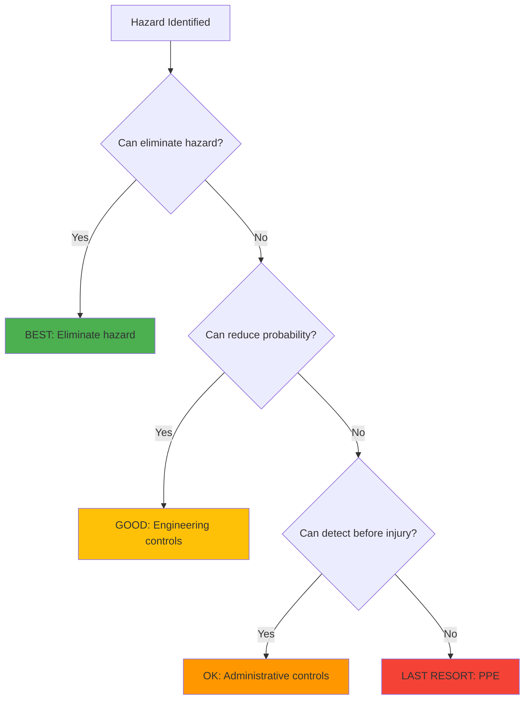

# Chapter 11: Safety & Best Practices

## Overview

**Learning Objectives:**
1. Conduct risk assessments for humanoid robot operations
2. Implement safety-critical software patterns
3. Understand ethical implications of autonomous robots
4. Follow professional robotics development standards
5. **Build safe, responsible robotics systems** ⭐

:::info Prerequisites
Complete [Chapter 10](./chapter-10-hardware-lab-setup) - Hardware deployment
:::

**Estimated Duration**: 4 hours (lecture + exercises)

---

## Safety Hierarchy

### Risk Mitigation Layers



**Priority Order**:
1. **Elimination**: Remove hazard (e.g., use simulation instead of hardware)
2. **Engineering Controls**: Physical safeguards (e-stop, safety cages)
3. **Administrative Controls**: Procedures, training, access restrictions
4. **Personal Protective Equipment (PPE)**: Safety glasses, gloves

---

## Physical Safety

### Emergency Stop System

**Requirements**:
- **Accessible**: E-stop within arm's reach from any position
- **Distinctive**: Red mushroom button, clearly labeled
- **Fail-safe**: Cutting power must stop ALL motion
- **Latching**: Requires manual reset (not auto-reset)

**Implementation**:
```python title="safety/emergency_stop.py"
"""
Purpose: Monitor emergency stop button and halt all robot motion
Prerequisites: GPIO button on Jetson
Expected Output: Immediate motor shutdown on button press
"""

import RPi.GPIO as GPIO
import rclpy
from rclpy.node import Node
from geometry_msgs.msg import Twist

class EmergencyStopMonitor(Node):
    def __init__(self):
        super().__init__('emergency_stop_monitor')

        # Set up GPIO for E-stop button (active low)
        GPIO.setmode(GPIO.BCM)
        GPIO.setup(17, GPIO.IN, pull_up_down=GPIO.PUD_UP)

        # Velocity command publisher (to override with zeros)
        self.vel_pub = self.create_publisher(Twist, '/cmd_vel', 10)

        # Timer to check button state
        self.timer = self.create_timer(0.01, self.check_estop)  # 100 Hz

        self.estopped = False

    def check_estop(self):
        # Read button (pressed = LOW)
        if GPIO.input(17) == GPIO.LOW and not self.estopped:
            self.estopped = True
            self.get_logger().error("🚨 EMERGENCY STOP PRESSED! 🚨")
            self.halt_robot()

    def halt_robot(self):
        """Send zero velocity command to stop all motion."""
        stop_cmd = Twist()  # All zeros by default
        self.vel_pub.publish(stop_cmd)

        self.get_logger().info("Robot halted. Reset E-stop to resume.")

def main(args=None):
    rclpy.init(args=args)
    monitor = EmergencyStopMonitor()
    rclpy.spin(monitor)
    monitor.destroy_node()
    rclpy.shutdown()

if __name__ == '__main__':
    main()
```

---

### Workspace Safety Zones

**Markings**:
- **Red Zone**: Robot operating area (keep clear during operation)
- **Yellow Zone**: Observer area (safe viewing distance)
- **Green Zone**: Control station (E-stop accessible)

**Minimum Distances**:
- Human-robot separation: ≥2m during autonomous operation
- Obstacle clearance: ≥0.5m from walls, furniture

---

## Software Safety

### Safety-Critical Coding Standards

#### Rule 1: No Dynamic Memory Allocation in Real-Time Code

```python
# ❌ BAD: Dynamic allocation in control loop
def control_loop(self):
    obstacles = []  # New list every loop
    for obstacle in sensor_data:
        obstacles.append(obstacle)  # Dynamic growth
```

```python
# ✅ GOOD: Pre-allocated buffers
class SafeController:
    def __init__(self):
        self.obstacle_buffer = [None] * 100  # Fixed size
        self.obstacle_count = 0

    def control_loop(self):
        self.obstacle_count = 0
        for obstacle in sensor_data:
            if self.obstacle_count < 100:
                self.obstacle_buffer[self.obstacle_count] = obstacle
                self.obstacle_count += 1
```

---

#### Rule 2: Watchdog Timers for Critical Processes

```python
class VelocityCommandWatchdog(Node):
    def __init__(self):
        super().__init__('velocity_watchdog')

        self.subscription = self.create_subscription(
            Twist,
            '/cmd_vel',
            self.velocity_callback,
            10
        )

        # Watchdog timer: expect commands every 0.1s
        self.watchdog_timer = self.create_timer(0.15, self.watchdog_timeout)
        self.last_command_time = self.get_clock().now()

    def velocity_callback(self, msg):
        self.last_command_time = self.get_clock().now()

    def watchdog_timeout(self):
        time_since_last = (self.get_clock().now() - self.last_command_time).nanoseconds / 1e9

        if time_since_last > 0.15:
            self.get_logger().error("Velocity command timeout! Stopping robot.")
            self.publish_zero_velocity()
```

---

#### Rule 3: Input Validation and Sanitization

```python
def set_velocity(self, linear_x: float, angular_z: float):
    """Set robot velocity with safety checks."""

    # Validate ranges
    MAX_LINEAR = 0.5  # m/s
    MAX_ANGULAR = 1.0  # rad/s

    if abs(linear_x) > MAX_LINEAR:
        self.get_logger().warn(f"Linear velocity {linear_x} exceeds max {MAX_LINEAR}, clamping")
        linear_x = max(-MAX_LINEAR, min(MAX_LINEAR, linear_x))

    if abs(angular_z) > MAX_ANGULAR:
        self.get_logger().warn(f"Angular velocity {angular_z} exceeds max {MAX_ANGULAR}, clamping")
        angular_z = max(-MAX_ANGULAR, min(MAX_ANGULAR, angular_z))

    # Additional check: IMU tilt
    if abs(self.imu_roll) > 0.5:  # 28 degrees
        self.get_logger().error("Robot tilting! Rejecting velocity command.")
        linear_x, angular_z = 0.0, 0.0

    # Publish validated command
    cmd = Twist()
    cmd.linear.x = linear_x
    cmd.angular.z = angular_z
    self.vel_publisher.publish(cmd)
```

---

## Risk Assessment

### Hazard Identification Checklist

| Hazard | Probability | Severity | Risk Level | Mitigation |
|--------|-------------|----------|------------|------------|
| Robot collides with human | Medium | Critical | HIGH | LIDAR safety zone, velocity limits |
| Battery fire | Low | Critical | MEDIUM | LiPo fire bag, temp monitoring |
| Fall from table | Medium | Moderate | MEDIUM | Cliff detection sensor |
| Software crash | High | Minor | MEDIUM | Watchdog timer, auto-restart |
| Incorrect object grasping | Medium | Minor | LOW | Confidence threshold ≥0.7 |

**Risk Formula**: Risk = Probability × Severity

---

### Pre-Operation Safety Checklist

```markdown
# Robot Operation Safety Checklist

## Pre-Power-On
- [ ] Workspace clear of obstacles and people
- [ ] Emergency stop button functional (test press + release)
- [ ] Battery level ≥20%
- [ ] All sensors connected and recognized
- [ ] Safety zones marked on floor

## Power-On Sequence
- [ ] Power on Jetson Orin
- [ ] Wait for ROS 2 nodes to start (check `ros2 node list`)
- [ ] Verify sensor data streams in RViz
- [ ] Test emergency stop (press → verify motion halts)

## During Operation
- [ ] Monitor battery level (alert at 15%)
- [ ] Check for error messages in logs
- [ ] Keep E-stop within reach
- [ ] Maintain safe distance (≥2m)

## Post-Operation
- [ ] Press E-stop before approaching robot
- [ ] Power off Jetson
- [ ] Disconnect battery
- [ ] Log any anomalies in lab notebook
```

---

## Ethical Considerations

### The Three Laws of Robotics (Asimov, Updated)

1. **Safety**: A robot may not injure a human or, through inaction, allow a human to be harmed.
2. **Obedience**: A robot must obey human orders, except where conflicting with the First Law.
3. **Self-Preservation**: A robot must protect itself, except where conflicting with the First or Second Law.

**Modern Additions**:
4. **Privacy**: A robot must not record or transmit data without explicit consent.
5. **Transparency**: A robot's decision-making process must be explainable.

---

### Ethical Dilemmas

#### Scenario 1: Trolley Problem for Robots

A humanoid robot detects an unavoidable collision:
- Path A: Swerve into wall (damages robot, $5,000 cost)
- Path B: Continue straight (minor injury to human, $0 robot damage)

**Question**: Should the robot prioritize human safety over self-preservation?

**Answer**: Yes. First Law takes precedence. Robot must choose Path A.

---

#### Scenario 2: Data Collection

Your robot uses cameras for navigation. It incidentally captures faces of household members.

**Question**: Is informed consent required? How should data be stored?

**Best Practice**:
1. Inform users about data collection
2. Store data locally (not cloud) by default
3. Implement data deletion on request
4. Use on-device processing (no raw images leave robot)

---

## Professional Development

### Code Quality Standards

**Documentation**:
- Every function has docstring (purpose, inputs, outputs)
- README in every package (installation, usage, examples)
- Inline comments for non-obvious logic

**Testing**:
- Unit tests for all skills (≥80% code coverage)
- Integration tests for multi-skill workflows
- Hardware-in-the-loop tests before deployment

**Version Control**:
- Meaningful commit messages ("Add obstacle avoidance" not "fix bug")
- Branch naming: `feature/vla-integration`, `bugfix/nav-crash`
- Pull requests require ≥1 reviewer

---

### Continuous Improvement

**Post-Operation Review**:
1. What worked well?
2. What unexpected behaviors occurred?
3. How can we prevent failure modes?
4. Update documentation based on learnings

**Failure Analysis Template**:
```yaml
incident_id: 2025-11-29-001
date: 2025-11-29
description: "Robot got stuck in doorway for 60 seconds"

root_cause:
  - Costmap inflation radius too large
  - Doorway width (0.9m) < inflated robot footprint (1.1m)

immediate_fix:
  - Manually moved robot
  - Reduced inflation radius from 0.3m to 0.2m

long_term_fix:
  - Add doorway detection skill
  - Dynamic inflation radius based on environment

lessons_learned:
  - Test navigation in narrow spaces before deployment
  - Add timeout recovery behavior (<30s stuck → re-plan)
```

---

## Exercises

### Exercise 1: Conduct Risk Assessment (Medium)

**Requirements**:
1. Identify ≥5 hazards in your humanoid setup
2. Rate probability and severity
3. Propose mitigations for HIGH and MEDIUM risks

**Acceptance Criteria**:
- Risk assessment table completed
- Mitigations implemented for ≥3 hazards

---

### Exercise 2: Implement Safety Watchdog (Hard)

**Requirements**:
1. Create watchdog node monitoring battery, IMU, command timeout
2. Trigger emergency stop if any condition violated
3. Test with simulated failures

**Acceptance Criteria**:
- Watchdog detects low battery (test at 15%)
- Watchdog detects tilt (test by manually tilting robot)
- Watchdog detects command timeout (stop publishing to `/cmd_vel`)

---

### Exercise 3: Ethical Case Study Analysis (Easy)

**Requirements**:
1. Read case study: [Robot Ethics and Privacy](https://example.com)
2. Write 300-word analysis addressing:
   - Ethical concerns raised
   - How your robot design addresses them
   - Trade-offs between functionality and privacy

**Acceptance Criteria**:
- Analysis cites specific design decisions
- Considers user perspective
- Proposes actionable improvements

---

## Assessment Questions

<details>
<summary><strong>Q1</strong>: Why are watchdog timers critical for safety-critical systems?</summary>

**Answer**: Watchdog timers detect software failures (crashes, infinite loops) that might otherwise leave the robot in an unsafe state. If a critical process fails to "check in" within the expected interval, the watchdog triggers a fail-safe action (e.g., emergency stop).

**Example**: If navigation node crashes, velocity commands stop. Without a watchdog, the robot might continue moving with the last command. With a watchdog, motion stops after 150ms of no updates.

</details>

<details>
<summary><strong>Q2</strong>: What is the difference between fail-safe and fail-operational?</summary>

**Answer**:
- **Fail-Safe**: System enters safe state on failure (e.g., E-stop cuts all power)
- **Fail-Operational**: System continues operating with degraded performance (e.g., switch to backup sensor)

**Humanoid Example**: Navigation failure → fail-operational (use odometry instead of VSLAM). Battery critical → fail-safe (emergency stop).

</details>

<details>
<summary><strong>Q3</strong>: How do you balance robot autonomy with human oversight?</summary>

**Answer**: Use **adjustable autonomy**:
- **Level 0** (Manual): Human controls every action (teleoperation)
- **Level 1** (Assisted): Robot suggests actions, human approves
- **Level 2** (Semi-Autonomous): Robot executes tasks, human monitors
- **Level 3** (Fully Autonomous): Robot operates independently, alerts human on exceptions

**Best Practice**: Start at Level 1-2 during development, graduate to Level 3 only after extensive testing.

</details>

---

## Self-Check

Course completion! Verify you can:

- [ ] Conduct risk assessment for robot operations
- [ ] Implement emergency stop system
- [ ] Write safety-critical code (watchdogs, input validation)
- [ ] Analyze ethical implications of autonomous robots
- [ ] Follow professional development standards
- [ ] **Build safe, responsible humanoid systems** ⭐

---

## Course Reflection

**You've completed all 11 chapters!**

### Skills Acquired

**Layer 1 (Foundation)**:
- ROS 2 fundamentals (nodes, topics, services)
- URDF robot modeling
- RViz visualization

**Layer 2 (AI-Assisted)**:
- Gazebo simulation
- Unity visualization
- AI-accelerated workflows

**Layer 3 (Intelligence Design)**:
- VSLAM and perception skills
- Navigation and RL control
- Reusable skill libraries

**Layer 4 (Spec-Driven Integration)**:
- VLA multimodal integration
- End-to-end autonomous systems
- Professional deployment

**Practice**:
- Hardware setup (Jetson, sensors)
- Safety and ethics

---

## Next Steps

**Career Paths**:
1. **Robotics Software Engineer**: Apply to companies building humanoid robots (Tesla, Figure, 1X)
2. **Research**: Pursue PhD in robot learning, human-robot interaction
3. **Entrepreneurship**: Build your own robotics startup
4. **Open Source**: Contribute to ROS 2, Isaac Sim, or humanoid projects

**Continuing Education**:
- Advanced RL (model-based, offline RL)
- Multi-agent coordination
- Sim-to-real transfer techniques
- Human-robot collaboration

---

## References

1. [ISO 13482: Safety Requirements for Personal Care Robots](https://www.iso.org/standard/53820.html)
2. [IEEE P7001: Transparency of Autonomous Systems](https://standards.ieee.org/project/7001.html)
3. [Robot Ethics (Asimov, 1942)](https://en.wikipedia.org/wiki/Three_Laws_of_Robotics)
4. [Safety-Critical Software Development Standards](https://en.wikipedia.org/wiki/DO-178C)

---

**Chapter Status**: ✅ Complete
**Last Updated**: 2025-11-29
**Course Status**: 🎓 All 11 chapters complete!
